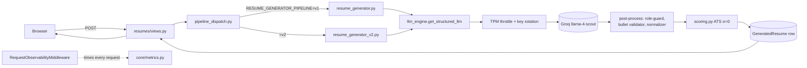
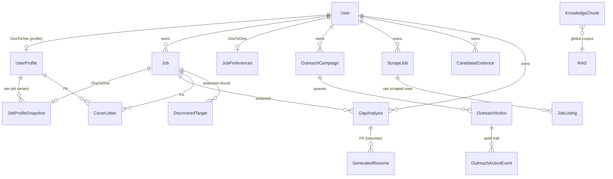
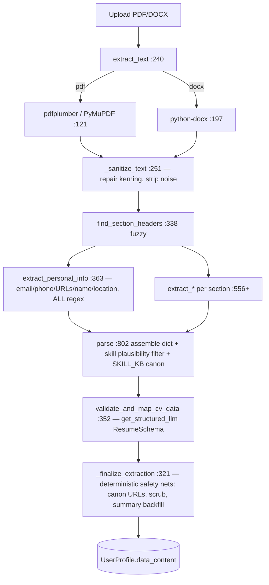
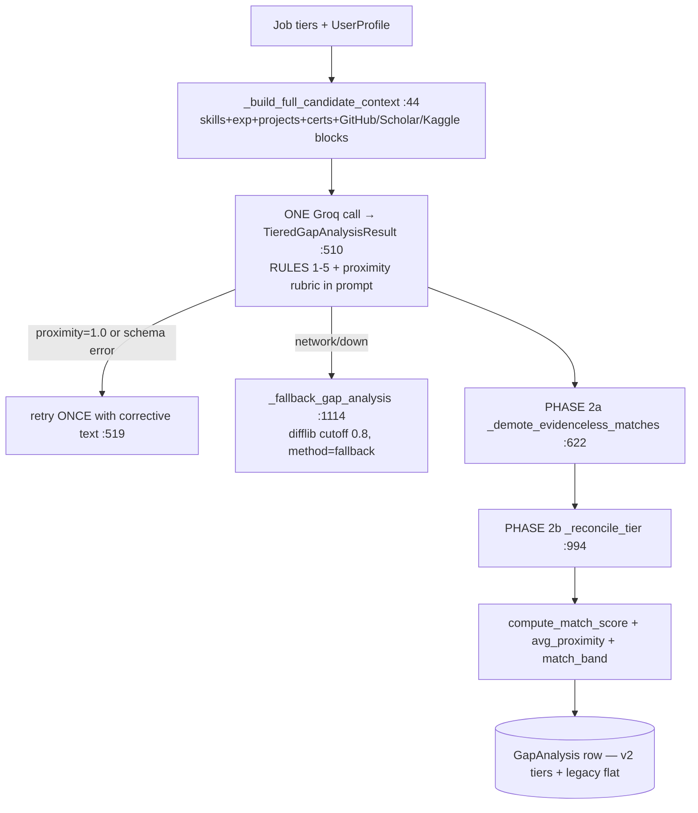

# PROJECT_CONTEXT.md — SmartCV

> **Generated:** 2026-06-09 · **Branch:** `feat/rag-knowledge-base` · **Commit:** `e9566db` · **Python:** 3.13.9 · **Repo root:** `G:\New folder\SmartCV`
>
> **How current is this?** Built by reading the actual source at commit `e9566db` with the working tree in its 2026-06-09 state (settings.py + docs/benchmarks.md have uncommitted edits; several `benchmarks/results/2026-06-0*` dirs are untracked). Every architectural claim is traceable to a real `file:line`. Benchmark numbers are pulled from the JSON artifacts and dated individually. Where a fact could not be verified it is tagged **⚠ unverified** or **⚠ assumption**. Maturity of every component is labelled **Implemented / Partial / Stub / Dead-or-unused / TODO**.
>
> This file is the deep reference. The slim `CLAUDE.md` summarises it and links back here by section. An older `SMARTCV_COMPLETE_CONTEXT.md` (2,332 lines) also exists in the repo root — it predates this document; prefer this one.

---

## Table of Contents

0. [The 60-Second Pitch](#0--the-60-second-pitch)
1. [System Overview](#1--system-overview)
2. [Tech Stack](#2--tech-stack)
3. [Repository Map](#3--repository-map)
4. [The Data Model](#4--the-data-model)
5. [The LLM Hub & Per-Task Routing](#5--the-llm-hub--per-task-routing)
6. [Pydantic Schema Catalog](#6--pydantic-schema-catalog)
7. [The Pipelines](#7--the-pipelines)
8. [The Anti-AI-Tell / Prompt-Guard System](#8--the-anti-ai-tell--prompt-guard-system)
9. [Front-End Architecture](#9--front-end-architecture)
10. [The Chrome Extension](#10--the-chrome-extension)
11. [External Integrations](#11--external-integrations)
12. [Config & Environment](#12--config--environment)
13. [Observability](#13--observability)
14. [Evaluation & Benchmarks](#14--evaluation--benchmarks)
15. [Testing](#15--testing)
16. [End-to-End Walkthroughs](#16--end-to-end-walkthroughs)
17. [Conventions & Design Philosophy](#17--conventions--design-philosophy)
18. [Known Issues, Tech Debt & Stubs](#18--known-issues-tech-debt--stubs)
19. [Glossary](#19--glossary)
20. [Appendix: Complete File Index](#20--appendix-complete-file-index)
21. [Maintenance](#21--maintenance)

---

## 0 · THE 60-SECOND PITCH

**SmartCV turns "I think I'm a fit for this job" into evidence.** A job seeker uploads a CV (PDF/DOCX), pastes or scrapes a job description, and SmartCV does four things no résumé builder bundles together:

1. **Parses the CV into a single structured master profile** (`UserProfile.data_content`, one JSONB blob) and enriches it with live signals from GitHub, Google Scholar, Kaggle, and (opt-in) LinkedIn.
2. **Runs a two-phase gap analysis** — an LLM categorises every required skill as matched / partial / missing, then a *deterministic* reconciliation pass guarantees that **every** job skill is accounted for and that every "match" is grounded in real evidence (no silent drops, no flattering hallucinations).
3. **Generates an ATS-optimised, tailored résumé** whose bullets are grounded in extracted facts, scored by a *deterministic* ATS scorer (σ=0), and scrubbed of "AI tells" by a prompt-guard + validator system — then opens it in an `Edit | Analyze` editor whose interactive "why this score" panel proposes grounded improvements and **asks for real numbers instead of inventing them** (§7.8), with a live preview that renders the same template as the downloaded PDF (§7.9).
4. **Drafts an outreach campaign** and pairs with a Chrome extension that discovers reachable people from inside the user's own LinkedIn tab and queues personalised connect-with-note drafts — **for review, never auto-sent.**

**The core bet:** an LLM is a brilliant *writer* and a dangerous *bookkeeper*. So SmartCV lets the model **propose** (categorise, draft, phrase) and lets **deterministic Python dispose** (reconcile coverage, ground every claim, compute every number, enforce voice). The whole codebase is an essay on "model proposes, code disposes, fail toward honesty."

**Who it's for:** early-career CS/software engineers, with explicit MENA-region context (the author, Zeyad, is a CS student at KSIU; SmartCV is his graduation project).

---

## 1 · SYSTEM OVERVIEW

SmartCV is a **server-rendered Django 5.2 monolith** (6 apps) with an intelligence tier built on Groq LLM calls and a thin deterministic-Python "guard rail" layer around every model call. It is **synchronous by design** — `django-q` was removed; typical LLM latency is 2-3 s and the request thread waits. The single exception is the Playwright job-discovery scraper, which spawns a daemon thread (`jobs/services/job_sources/runner.py`).

### Tiers

```
┌─────────────────────────────────────────────────────────────────────────────┐
│ PRESENTATION   Django templates · Tailwind v4 (CSS-first) · Alpine.js (CDN)  │
│                Shepherd.js tours · NO custom JS files · Chrome MV3 extension  │
├─────────────────────────────────────────────────────────────────────────────┤
│ APPLICATION    6 apps: accounts · profiles · jobs · analysis · resumes · core │
│ + SERVICE      views.py (thin) → services/*.py (the real logic)               │
├─────────────────────────────────────────────────────────────────────────────┤
│ INTELLIGENCE   profiles/services/llm_engine.py  ── the ONE LLM hub            │
│  (LLM)         Groq llama-4-scout · per-task key rotation · TPM throttle       │
│  (Determ.)     gap reconciliation · ATS scorer · bullet validator · fact      │
│                grounding · RAG retrieval (all-MiniLM-L6-v2, 384-dim)           │
├─────────────────────────────────────────────────────────────────────────────┤
│ DATA           PostgreSQL (Supabase PgBouncer :6543) + pgvector               │
│                UserProfile.data_content JSONB master + derivative tables       │
│                In-memory SQLite under `manage.py test`                         │
└─────────────────────────────────────────────────────────────────────────────┘
```

### Deterministic vs LLM

| Deterministic (Python, no model) | LLM (Groq, structured output) |
|---|---|
| Gap **Phase 2** reconciliation (`gap_analyzer.py`) | Gap **Phase 1** categorisation |
| ATS scoring (`resumes/services/scoring.py`, σ=0) | CV structuring (`llm_validator.py`) |
| Bullet validator / anti-AI-tell (`bullet_validator.py`) | JD skill extraction (`skill_extractor.py`) |
| Signal merge & dedupe (`signal_merger.py`) | Résumé bullet generation (v1 & v2) |
| Fuzzy skill matcher `skills_match()` (cutoff 0.85) | Project enrichment, dedupe adjudication |
| Inclusion planner, role-identity guard, sanitizer | Interviewer chat, outreach drafting, cover letter |
| RAG embedding/retrieval + facet diversification | Supervisor (vision) review, salary script |
| Job ranking prefilter (rapidfuzz) | Learning-path generation |

### Request lifecycle (a representative tailored-resume request)



Every inbound request passes through `core.middleware.RequestObservabilityMiddleware` (registered last, `settings.py:80`), which times it, stamps `X-Response-Time-ms`, and feeds `core/metrics.py`. See [§13](#13--observability).

---

## 2 · TECH STACK

Versions are exact from `requirements.txt` and `package.json`. "Why" is from code comments/configs where documented, else tagged **⚠ rationale inferred**.

| Technology | Version | Role | Why (cited) |
|---|---|---|---|
| **Django** | `>=5.2.7,<6.0` | Web framework, ORM, templates | Monolith; `requirements.txt:1` |
| **Python** | `3.13.9` | Runtime | Confirmed live (`python --version`); many pins are explicitly "3.13 wheels" fixes |
| **PostgreSQL / Supabase** | PgBouncer txn pooling, port 6543 | Primary DB | `settings.py:121-150`; needs `DISABLE_SERVER_SIDE_CURSORS`, `sslmode=require`, `conn_max_age=60` |
| **pgvector** | `0.4.2` | Vector columns (384-dim) | RAG + (dormant) profile vectors; `requirements.txt:19` |
| **Groq + LangChain** | `langchain_groq.ChatGroq` | LLM inference | Model `meta-llama/llama-4-scout-17b-16e-instruct`; `llm_engine.py:178` |
| **Pydantic** | `>=2.9.0` | Structured-output contracts | 2.5's pydantic-core lacks 3.13 wheels; `requirements.txt:20` |
| **sentence-transformers** (via `huggingface_hub>=0.36`) | `all-MiniLM-L6-v2` | 384-dim embeddings for RAG | `embeddings.py:18` |
| **Tailwind CSS** | `@tailwindcss/cli ^4.2.2` | Styling, CSS-first `@theme` | No `tailwind.config.js`; `package.json:11`, `static/src/input.css` |
| **Alpine.js** | 3.x (CDN) | Client interactivity | No build step; loaded in `base.html:26` |
| **Shepherd.js** | `11.2.0` (CDN) | Guided product tours | `base.html:33` |
| **WeasyPrint** | `>=67.0` | **Primary** résumé PDF render | `resumes/services/pdf_exporter.py`; needs GTK3 on Windows (`docs/PDF_RENDERING.md`) |
| **xhtml2pdf** | `>=0.2.16` | **Legacy** profile-PDF path | `resumes/services/pdf_generator.py`; `requirements.txt:14` |
| **python-docx** | `1.1.0` | DOCX export | `resumes/services/docx_exporter.py` |
| **pdfplumber** | `0.10.3` (+ PyMuPDF `fitz`) | CV text extraction | `profiles/services/cv_parser.py` |
| **rapidfuzz** | `3.5.2` | Job-ranking prefilter, fuzzy matching | `jobs/services/job_scoring.py` |
| **Playwright** | `>=1.48` | Job-board discovery scrapers | `requirements.txt:28`; daemon-thread runner |
| **Selenium + undetected-chromedriver** | `>=4.20` / `>=3.5.5` | Opt-in LinkedIn profile scrape | `requirements.txt:25-27`; gated OFF by default |
| **DRF + simplejwt** | `3.14.0` / `>=5.3.1` | JWT auth scaffolding | `settings.py:196-200` (note: most views are session-auth) |
| **whitenoise** | `6.6.0` | Static serving | `settings.py:70` |
| **django-cors-headers** | `4.3.1` | CORS | `settings.py:203-205` |
| **django-debug-toolbar** | `6.3.0` | Dev profiling | Auto-disabled under tests / `DEBUG=False`; `settings.py:83-98` |
| **python-frontmatter** | `1.1.0` | Parse YAML frontmatter in KB `.md` | `build_knowledge_index.py` |
| **coverage** | `7.13.5` | Test coverage | `.coveragerc` |

---

## 3 · REPOSITORY MAP

```
SmartCV/
├── smartcv/                 Django project: settings.py, urls.py, wsgi/asgi, settings_constants.py (⚠ stale Gemini constants)
├── accounts/               Custom UUID User model (email auth) + outreach_token; register/login/password-reset
├── profiles/               THE heart: CV parsing, JSONB master profile, chatbot, aggregators, RAG, outreach, project enrichment
│   ├── services/           ~40 service modules (cv_parser, llm_engine, schemas, signal_merger, prompt_guards, ...)
│   ├── knowledge/          RAG corpus: 68 .md rule files across 7 categories (ats_rules, banned_patterns, ...)
│   └── management/commands/ build_knowledge_index, migrate_profile_schema, rebuild_profiles_with_github
├── jobs/                   Job input (URL/paste), tiered skill extraction, discovery scrapers + ranking
│   └── services/
│       ├── scrapers/       SINGLE-JD-URL parsers (greenhouse, lever, indeed, linkedin, generic JSON-LD)
│       └── job_sources/    MULTI-JOB Playwright/Selenium discovery scrapers + daemon-thread runner
├── analysis/               Two-phase gap analysis engine, learning paths, salary negotiation, skill scoring
│   └── services/           gap_analyzer.py (1165), learning_path_generator, salary_negotiator, skill_score
├── resumes/                Tailored résumé generation (v1 + v2), ATS scorer, findings UX, fact grounding, exporters
│   └── services/           ~30 modules: scoring (ATS), resume_generator(_v2), planner_v2, reviewer_v2, fact_extractor, ...
├── core/                   Landing/dashboard/insights/applications, agent chat, career-stage logic, health/metrics
│   └── services/           agent_chat, action_planner, career_stage
├── templates/              63 server-rendered templates (base.html shell + per-app + components/)
├── static/                 src/input.css (Tailwind @theme tokens) → css/output.css (committed, minified)
├── extension-outreach/     Chrome MV3 extension: manifest, background SW, content scripts, popup, options
├── benchmarks/             Evaluation harness: run_all + 9 phase scripts + fixtures + dated results/ JSON
├── tests/                  pytest suite: services/ unit tests + integration/ record-replay harness (conftest.py)
├── tools/                  KB-snapshot capture + recording checks (capture_kb_snapshot, check_recordings, smoke_kb_snapshot)
├── docs/                   benchmarks.md, gap_analysis_system.md, PDF_RENDERING.md, outreach-v2-spec.md, qa/
├── poster_mockups/         Static HTML poster mockups (dashboard, gap_analysis)
├── CLAUDE.md               Slim project guide (this rewrite) → links into PROJECT_CONTEXT.md
├── README.md               Public README (⚠ benchmark + test-count numbers are stale; see §14/§15)
├── requirements.txt · package.json · pytest.ini · .coveragerc · .env.example
└── manage.py               (contains a Python-3.13 Windows WMI-hang workaround)
```

**Untracked / auxiliary (present in the working tree, NOT part of the app):** `grad_book/` (24 files — Python+Word-COM graduation-book generator), `latex_book/` (26 files — LaTeX book variant), `linkedin_debug/` (9 HTML dumps), `improving_resume_output/`, `chrome_profiles/`, `storage_state/`, `logs/`, `media/`, `test cvs/` (gitignored real CVs), plus loose PDFs/HTML dumps and `PIPELINE_ANALYSIS.md`. These are working artifacts for the thesis/book and ad-hoc debugging, not the SmartCV product.

---

## 4 · THE DATA MODEL

The defining decision: **the entire parsed CV is one JSONB column** (`UserProfile.data_content`). Per-section DB tables were *removed* in migrations `0005`-`0008`; property accessors preserve backward compatibility. Everything else (gap analyses, résumés, jobs, outreach) is a derivative table keyed off the profile/user/job.



### `accounts.User` — `accounts/models.py:5`, `db_table='users'`
Custom `AbstractUser`. `AUTH_USER_MODEL='accounts.User'`. **UUID PK** (`id`, `:6`), `email` unique = login (`USERNAME_FIELD='email'`, `:18`; `REQUIRED_FIELDS=['username']`). `outreach_token` (UUID, unique, db_index, nullable — extension pairing, **no TTL by design**, `:8-13`), `outreach_token_rotated_at` (`:14`), `created_at`/`updated_at`. Method `rotate_outreach_token()` (`:24`) issues a fresh UUID + stamps the rotation time. ⚠ The custom User is **not registered in admin** (`accounts/admin.py:3`).

### `profiles.UserProfile` — `profiles/models.py:7`, `db_table='user_profiles'` — **the master profile**
- `id` UUID PK; `user` OneToOne→User CASCADE `related_name='profile'`.
- Flat contact columns: `full_name, email, phone, location, linkedin_url, github_url` (`:19-24`) — convenience mirrors of `data_content`.
- **`data_content = JSONField(default=dict)`** (`:38`) — the single JSONB store holding skills/experiences/education/projects/certifications + arbitrary CV sections + `*_signals` enrichment blobs + UI flags. **GIN index** `profile_data_gin` with `jsonb_path_ops` (`:176`).
- **Multi-vector embeddings** (all `VectorField(dimensions=384)`, nullable): `embedding`, `embedding_skills`, `embedding_experience`, `embedding_education` (`:41-46`). **Dormant** — "largely deprecated in favor of pure LLM-based analysis" (CLAUDE.md / pgvector note).
- `uploaded_cv` FileField; `created_at`/`updated_at`.
- **Property accessors** (the JSONB compat layer): `skills`, `experiences`, `education`, `projects`, `certifications` (read/write `data_content[key]`); `projects_typed` (`:146` — the immutable user-authored bucket, kept separate so enrichment never re-contaminates dedupe); URL/summary helpers `portfolio_url`, `kaggle_url`, `scholar_url`, `normalized_summary`, `objective`.

### `profiles.JobProfileSnapshot` — `:180`
Per-job profile variant. `profile` FK CASCADE; `job` OneToOne→`jobs.Job` `related_name='profile_snapshot'`. Holds `data_content` (post-chatbot) + `pre_chatbot_data` (rollback).

### `profiles` outreach cluster
- **`OutreachCampaign`** (`:198`) — `user`+`job` FK, `status` (draft/running/paused/done/failed), `daily_invite_cap` (default 15), `summary_stats` JSONB cache, `last_activity_at` (db_index).
- **`DiscoveredTarget`** (`:231`) — LinkedIn people the extension scraped. `source` (hiring_team/people_you_know/company_people). **Unique** `(user, job, handle)`.
- **`OutreachAction`** (`:263`) — `campaign` FK, `kind` (connect/message), `status` (queued→in_flight→sent/accepted/failed/skipped), `payload`, `attempts`. **Index** `(campaign, status)`; **unique** `(campaign, target_handle, kind)`.
- **`OutreachActionEvent`** (`:304`) — append-only audit trail; `actor` (extension/user/server_dispatch/server_recovery/server_finish). **Index** `(action, created_at)`.

### `profiles.JobPreferences` — `:343`, `db_table='job_preferences'`
OneToOne user. `keyword`, `locations[]`, `sources[]`, `experience_levels[]`, `workplace_types[]` (JSON), `date_posted`, `max_jobs` (default 30), backoff fields `last_scan_at`/`last_scan_failed_at`/`scan_failure_count`. `to_params()` (`:385`) is the exact dict the discovery runner consumes.

### RAG tables
- **`KnowledgeChunk`** (`:398`) — global RAG corpus row. `kb_id` unique; `title/body/concrete_rule/sources`; facets `type`(idx)/`roles`/`seniority`/`industries`(JSON)/`region`(idx)/`weight`; `embedding` VectorField(384). Populated by `build_knowledge_index`. (Field is `type`, **not** `category`.)
- **`CandidateEvidence`** (`:447`) — *per-user* evidence chunk for résumé-gen retrieval. `user` FK; `chunk_id` (stable, e.g. `experience:0:bullet:2`), `source_type`, `text`, `skill_tags` (JSON), `embedding`(384), `content_hash` SHA-256 (drives staleness rebuild). **unique** `(user, chunk_id)`; indexes `(user, content_hash)`, `(user, source_type)`.

### `jobs` app — `jobs/models.py`
- **`Job`** (`:7`, `db_table='jobs'`) — `id` UUID; `user` FK CASCADE; `url`(≤2000, nullable), `title`(required), `company`, `description`, `raw_html`; `extracted_skills` JSON (flat union, back-compat); **`extracted_skills_tiers`** JSON (`{must_have:[], nice_to_have:[]}`, v2 2026-05-14); `domain`; `application_status` (saved/applied/interviewing/offer/rejected); `embedding` VectorField(384) — **⚠ dormant, never populated** (only ever nulled by `_bust_job_embedding`). **No `updated_at`** (so JD-change detection is impossible).
- **`RecommendedJob`** (`:41`) — discovery output. `match_score` (0-100 int), `status` (new/saved/dismissed). App-layer dedup by `(user, url)` (no DB constraint).
- **`ScrapeJob`** (`:61`) — one discovery run; status pending/running/done/error/cancelled, progress fields, `cancel_requested` (cooperative cancel), `params_json`.
- **`JobListing`** (`:104`) — one raw scraped row (ephemeral). **unique** `(scrape_job, unique_hash)`; `make_hash()` = sha1(url) or `source|title|company|location`.

### `analysis.GapAnalysis` — `analysis/models.py`
Dual-format: legacy flat lists (`matched_skills`, `critical_missing_skills`, …) **and** v2 tiered JSONB (`matched_must_have`, `missing_must_have`, …). Plus `similarity_score`, `match_band`, `avg_proximity`. FK to `Job` + `User`; **unique** `(job, user)`. `user_asserted` semantics live inside the tier-object JSON (a match the user drag-dropped with no evidence; `evidence_source='user'`). Cached — the page renders from this row at zero LLM cost unless `?refresh=1`.

### `resumes` app — `resumes/models.py`
- **`GeneratedResume`** (`:5`, `db_table='generated_resumes'`) — **FKs `GapAnalysis`, NOT `Job` directly** (`:7`; Job reached via `resume.gap_analysis.job`). `content` JSONB (the structured résumé), `ats_score` float, `validation_report` JSONB (findings + stats), **`previous_best`** JSONB (content-stickiness snapshot: `{content, exported_at, ats_score_at_export, jd_identity_hash}`, written at export). `version` int — ⚠ defined but never incremented (a new row is created per generation). `html_content` — ⚠ defined but unused.
- **`CoverLetter`** (`:42`) — FKs `Job` + `UserProfile`; `content` plain text.

> **Embedding-dimension summary:** every `VectorField` in the codebase is **384-dim** (all-MiniLM-L6-v2): `UserProfile` ×4 (dormant), `KnowledgeChunk` ×1 (live), `CandidateEvidence` ×1 (live, v2 path), `Job` ×1 (dormant). `smartcv/settings_constants.py` claims 768-dim Gemini embeddings — **⚠ that file is stale/aspirational and unused** (it's in the `.coveragerc` omit list; the real stack is 384-dim local + Groq).

Migrations of note: `profiles/0005-0008` (the JSONB collapse — drop per-section columns, migrate data, remove old columns), `profiles/0013` (multi-vector embeddings), `profiles/0019` (KnowledgeChunk), `profiles/0020` (CandidateEvidence); `jobs/0007` (ScrapeJob+JobListing), `jobs/0008` (tiers + domain); `analysis/0003` (proximity-aware tiered gap fields).

---

## 5 · THE LLM HUB & PER-TASK ROUTING

**Every Groq call in the codebase goes through `profiles/services/llm_engine.py` (329 lines).** Three entry points:

```python
def get_llm(temperature=0.3, max_tokens=4096, task=None):              # plain text  (llm_engine.py:236)
def get_structured_llm(pydantic_schema, temperature=0.1, max_tokens=8000, task=None):  # :260
def get_llm_client(task=None):   # legacy OpenAI-mimicking shim — deprecated  # :327
```

Both `get_llm` / `get_structured_llm` return a **`_ThrottledLLM`** wrapper (`:92`) around `ChatGroq` (or `ChatGroq.with_structured_output(schema)`). The wrapper proxies all attribute access to the inner runnable (so `.with_structured_output()` chains keep working) but intercepts **`.invoke()`** to do two distinct things:

1. **TPM (tokens-per-minute) throttle** — before every call, `reserve_for_invoke(input, max_output_tokens)` consults the process-wide rolling-60s token bucket (`tpm_throttle.py`). Groq's on-demand tier caps each org at 30,000 tok/min; the budget is `GROQ_TPM_BUDGET` (default **28,000**, 2k headroom). Throttling sleeps *before* the call; disabled automatically under tests.
2. **TPD (tokens-per-day) key rotation** — on a daily-cap 429, it rebuilds the inner `ChatGroq` with the next configured key and retries. When all keys are exhausted it raises **`AllGroqKeysExhausted`** (`:12`) — *loud by design*, never a silent degrade (benchmarks depend on this).

A 429 is classified by Groq's message text (`_classify_rate_limit`, `:54`): "tokens per day" → rotate key; "tokens per minute" → sleep + retry same key (cap `_TPM_RETRY_MAX=3`); ambiguous → treated as TPM (sleeping never burns a key's daily budget).

### Per-task credential resolution
Each call site passes `task=...`. `_resolve_key_list(task)` (`:204`) builds an ordered key list: `GROQ_API_KEY_<TASK>`, then `…<TASK>2`, `…3`, `…4` (stop at first missing), then the global `GROQ_API_KEY` as final fallback (deduped). `_resolve_model(task)` checks `GROQ_MODEL_<TASK>` → global `GROQ_MODEL` → default `meta-llama/llama-4-scout-17b-16e-instruct` (`:178`). This lets the operator spread load across multiple Groq accounts so per-account rate limits don't bottleneck the whole pipeline (see `.env.example:24-65` for the recommended 4-key A/B/C/D mapping).

**v2 task aliases** (`_TASK_KEY_ALIASES`, `:187`): `resume_gen_v2→RESUME_GEN`, `gap_analyzer_v2_primary/_retry→GAP_ANALYZER` — so v2 tasks bind to existing key bases without an env rename.

**Known tasks** (from `core/health.py:86` `KNOWN_LLM_TASKS` + `.env.example`): `agent_chat, interviewer, resume_gen, gap_analyzer, skill_extractor, parser, validator, cover_letter, outreach, learning_path, salary, judge, project_enricher, supervisor`. Inspect routing live at `/healthz/llm/` (staff-only).

**Legacy shim:** `get_llm_client()` returns a `_LegacyClient` mimicking `client.chat.completions.create()` for un-migrated call sites — deprecated; new code uses `get_llm`/`get_structured_llm`.

---

## 6 · PYDANTIC SCHEMA CATALOG

`profiles/services/schemas.py` (1,032 lines) is the **contract layer** — the schemas handed to `get_structured_llm()`. There are **31 `BaseModel` classes** and zero Enum/Literal types ("enums" are simulated with `str` fields + normalization sets). The central design principle is **"input liberal, output strict"**: tool-call schemas use `extra='forbid'` (→ Groq `additionalProperties:false`), and `mode='before'` validators salvage LLM variance *before* Groq's server-side validator rejects the call.

### Canonical (live) schemas

| Schema | Line | Purpose | Used by (`file:line`) |
|---|---|---|---|
| **`ResumeSchema`** | 145 | Master CV parse target → `UserProfile.data_content` (`extra='allow'`) | `llm_validator.py:385` (`task=validator`) |
| **`TieredGapAnalysisResult`** | 328 | v2 gap output: 4 tier lists + soft gaps | `gap_analyzer.py:510` |
| ├ `MatchedSkill` | 205 | name + evidence_source + evidence_quote | (sub-schema) |
| └ `MissingSkill` | 244 | name + source_quote + proximity[0,1) + bridge_hint | (sub-schema) |
| **`JobExtractionResult`** | 358 | must/nice skills + domain | `skill_extractor.py:468` |
| **`ChatTurnResult`** | 405 | Interviewer turn (reply analysis + next question) | `interviewer.py:377` |
| **`SemanticValidationResult`** | 410 | Chatbot-answer relevance check | `semantic_validator.py:41` |
| **`OutreachCampaignResult`** | 420 | LinkedIn msg + cold-email subject/body | `outreach_generator.py:99` |
| **`ResumeContentResult`** | 756 | Top-level tailored résumé (`extra='allow'`) | `resume_generator.py:1627` |
| ├ `ResumeExperience` | 608 | one experience entry (`extra='forbid'`) | resume_generator local schemas |
| ├ `ResumeProject` | 669 | one project entry (`extra='forbid'`) | " |
| ├ `ResumeCertification` | 705 | one cert entry | " |
| └ `ResumeEducation` | 723 | one education entry | " |
| **`LearningPathResult`** | 829 (+`LearningPathItem` 816) | learning-path items | `learning_path_generator.py:151` |
| **`EnrichedProjectBatch`** | 871 (+`EnrichedProject` 842) | source→project bullets | `project_enricher.py:199,269,338,442` |
| **`DedupeBatch`** | 899 (+`DedupeDecision` 876) | project-dedupe verdicts | `project_dedupe.py:321` |
| **`SuggestedJobPreferences`** | 910 (+`KeywordCandidate` 904) | job-pref auto-fill | `preference_suggester.py:315` |
| **`SupervisorReview`** | 988 (+`SupervisorFinding` 952) | HR/CV supervisor verdict | `resume_supervisor.py:384` |
| CV sub-schemas: `Skill` 13, `Experience` 18, `Education` 79, `Project` 89, `Certification` 131, `ItemDetailed` 138 | | parts of `ResumeSchema` | `cv_parser` / `llm_validator` |

### Legacy / dead schemas (cleanup candidates)
- **`GapAnalysisResult`** (191) — legacy flat gap output; docstring says "use TieredGapAnalysisResult"; imported in `gap_analyzer.py:8` but the live call uses the tiered schema. Constructed only in tests.
- **`SkillListResult`** (353) — legacy flat skill list; imported in `skill_extractor.py:5` but no longer passed to `get_structured_llm`.
- **`GuardrailResult`** (415) — ⚠ **dead**: documented (interviewer guardrail) but never invoked anywhere.
- **`SectionFilterResult`** (810) — ⚠ **dead**: documented (résumé section filtering) but never invoked.

### Load-bearing validators (the contracts)
- `MissingSkill.reject_one` (`:312`) — raises `ValueError` if `proximity >= 1.0` (1.0 belongs in *matched*). The gap-analyzer's retry loop catches this and re-routes the skill.
- `MatchedSkill._coerce_str` / `MissingSkill._coerce_str_140` (`:235/:294`) — None→"", strip, **truncate to 140 chars** (Groq enforces `max_length` *before* Pydantic, so over-long quotes would break the whole tool call; truncation done in Python).
- `Experience/Project/ResumeExperience/ResumeProject.coerce_to_canonical` — `mode='before'` folds 9 bullet aliases (`highlights`, `achievements`, `responsibilities`, …) into the canonical `description: List[str]` and drops non-bullet extras so `extra='forbid'` doesn't reject. (The `List[str]`-vs-string trap; see CLAUDE conventions and commit `fd90299`.)
- `_coerce_null_strings` / `_flatten_string_list` — used across the résumé/supervisor schemas to turn `null` and nested objects into clean strings/lists.
- `SupervisorFinding/SupervisorReview.normalize` — coerce bare lists, finding-key aliases (issues/problems/results), and severity/layer/verdict vocab into canonical values.

---

## 7 · THE PIPELINES

### 7.1 · CV PARSING — `profiles/services/cv_parser.py` (deterministic) → `llm_validator.py` (LLM)

Two stages: a fully **deterministic** extractor produces a best-effort dict, then an **LLM** structures it into `ResumeSchema`, with a deterministic Python backstop.



| Step | Function | File:line | LLM? |
|---|---|---|---|
| Entry | `parse_cv` | `cv_parser.py:1123` | no |
| PDF/DOCX text | `extract_from_pdf` / `extract_from_docx` | `:121` / `:197` | no |
| Personal info | `extract_personal_info` | `:363` | no (regex + allowlists; leaves name null on doubt → LLM recovers) |
| Per-section regex | `extract_experience/education/skills/projects/certifications` | `:556`+ | no |
| Skill filter + canon | `_is_plausible_skill_name`, `_get_skill_canonicalizer` | `:990`, `:1096` | no |
| **LLM structuring** | `validate_and_map_cv_data` | `llm_validator.py:352` | **yes** (`task=validator`) |
| Deterministic backstop | `_finalize_extraction` | `llm_validator.py:321` | no |

The validator system prompt forbids `highlights`/`achievements` keys (forcing `description: List[str]`), disambiguates GitHub repo-vs-profile URLs, and bans hallucination — but **because "real Groq runs sometimes ignore the rules"** (`llm_validator.py:198`), the Python `_finalize_extraction` is the deterministic safety net (applied even when the LLM fails).

> **⚠ Dead path:** `cv_parser._refine_data_with_llm` (`:824-917`) references an undefined `LLM_MODEL` and uses the deprecated OpenAI shim; it is unreachable because `parse_cv` always calls `parse(use_llm_refinement=False)`. Docstrings still mention "Cerebras Cloud LLM" — stale (the project uses Groq). The spaCy NER path is scaffolded but disabled (`self.use_spacy=False`, `:50`).

### 7.2 · TWO-PHASE GAP ANALYSIS — `analysis/services/gap_analyzer.py` (the headline feature)

This is where "model proposes, code disposes" is most explicit. One LLM call categorises; then deterministic Phase 2 enforces honesty and 100% coverage.



**Phase 1 (LLM):** `_invoke` calls `get_structured_llm(TieredGapAnalysisResult, temperature=0.1, max_tokens=2400)`. The prompt embeds 5 rules (RULE 1 holistic/whole-skill grounding, RULE 2 directional specificity *broad-matches-narrow*, RULE 3 no-dupes + exact spelling, RULE 4 tier fidelity, RULE 5 soft-skill gaps) and a `_PROXIMITY_RUBRIC` (0.0-0.8 anchored; **1.0 is forbidden**). A schema/proximity error triggers one corrective retry; any other error falls back to a pure-`difflib` analysis (loudly labelled `analysis_method='fallback'`).

**Phase 2 — the deterministic reconciliation rules (each cited):**

*Phase 2a — honesty enforcement (`_demote_evidenceless_matches :622`):*
- **R1** empty-evidence: a `matched` entry with blank `evidence_quote` → demoted to `missing` proximity 0.0 (`:664`).
- **R2** profile-grounding: a matched skill whose name isn't grounded by `_skill_is_grounded` → demoted (catches "Firebase Messaging" off bare "Firebase") (`:666`).
- **R3** duplicate-drop: a demoted skill already present in the missing tier is dropped, not duplicated (`:677`).

*Phase 2b — tier-aware reconciliation (`_reconcile_tier :994`):*
- **R4** case-insensitive normalisation via `_norm` (`:1010`).
- **R5** cross-tier dedupe: drop any `missing` whose name is in the same-tier `matched` set (`:1024`).
- **R6** deterministic rescue: a LLM-marked-missing skill with real profile evidence is **promoted** to matched (`_rescue_missing :1031` — the "TensorFlow-in-a-project-tech-stack" case).
- **R7/R8** every JD must-have/nice-to-have is accounted: if not present, try evidence rescue, else append `MissingSkill(proximity=0.0, "No related evidence found in profile")` (`:1064-1103`).
- **R9** fuzzy cutoff **0.85**: `_is_accounted` treats a JD skill as matched if `difflib.get_close_matches(..., cutoff=0.85)` hits (absorbs LLM spelling drift) (`:1057`).

Grounding helpers (`_collect_profile_evidence :744`, `_skill_is_grounded :962`, `_phrase_variant_in_prose :913`) implement "holistic evidence" + "variant-aware prose grounding" — e.g. "REST API" grounds against "RESTful API services" by sliding 2-3-token windows through `skills_match()`. The shared matcher is `jobs/services/skill_extractor.py:238 skills_match(a, b, cutoff=0.85)` (canonical-form equality → `SequenceMatcher.ratio()≥0.85` → enumeration atom-split).

**Caching & self-report:** the page renders from the cached `GapAnalysis` row at zero LLM cost; `?refresh=1` forces recompute. The drag-drop endpoint `update_gap_skills` (`analysis/views.py:253`) re-splits the on-screen columns into the 4 DB tiers and grounds each dragged chip with the *same* `_skill_is_grounded`/`skills_match`; ungrounded chips are kept but flagged `user_asserted=True` / `evidence_source='user'` (never blocked, shown as "self-reported"). Skill score = `0.05 + 0.75·must_ratio + 0.20·nice_ratio` with empty-tier renormalisation (see [§7.4-scoring detail in skill_score below]).

### 7.3 · RESUME GENERATION — v1 (`resume_generator.py`) and v2 (`resume_*_v2.py`)

`pipeline_dispatch.py` selects on `RESUME_GENERATOR_PIPELINE` (default **`v1`**; unknown → v1 defensively).

**v1 (default, shipping path)** — `generate_resume_content_supervised :1739` → `generate_resume_content :1234`:

| # | Stage | Function:line |
|---|---|---|
| 2 | Sanitize profile (label-leak strip, first-person, zero-width) | `sanitize_profile_data :1267` |
| 5 | Domain detect (keyword, no LLM) | `_detect_job_domain :1285` |
| 6-8 | Build evidence context + **RAG standards** (gated by `RAG_ENABLED`) + v2 grounding block | `_build_standards_section :343`, `_build_v2_grounding :438` |
| 9 | Constructive CV from inclusion plan + identity allowlist | `_build_planner_aligned_cv :1018` |
| 12 | Assemble mega-prompt (field map + safety + ATS + human-voice) | `:1367-1516` |
| 13 | **Char-budget pre-slim** (>`RESUME_PROMPT_CHAR_BUDGET`=85000 → drop v2+standards blocks) | `:1596` |
| 14 | LLM call `get_structured_llm(ResumeContentResult, temp=0.7, max_tokens=8192)` | `:1627` |
| 15 | **413 retry** once with both blocks stripped | `:1645` |
| 16 | Salvage from `tool_use_failed` → offline fallback | `:1686` |
| — | **Post-process** every path: role-identity guard → bullet validator (`BULLET_AUTOFIX`) → `normalize_resume` → grounding check → regression check | `_post_process :1518` |
| — | **Supervisor loop** (gated `SUPERVISOR_ENABLED`, default **False**): generate→review (vision)→regen up to `SUPERVISOR_MAX_REVISION_ROUNDS`; best-draft elitism | `:1765-2008` |

**v2 (flagged-off evidence-first path)** — `pipeline_dispatch._generate_via_v2 :52`:
1. **Extract facts** → `FactStore` (`fact_extractor.extract_from_structured_profile` — no LLM, reliability `USER_ORIGINAL`).
2. **Plan** (`resume_planner_v2.build_plan :1051`) — validate/rank facts, allocate to sections under `DEFAULT_SECTION_CAPS` (summary 3 / skills 15 / experience 12 / projects 8 / education 4 / certs 8), `PER_SKILL_MENTION_CAP=3`, `PER_ENTITY_EXPERIENCE_CAP=4`. Raises if the store is empty.
3. **Honest title** (`seniority.honest_job_title`) — strips the JD's *target* seniority, prepends the candidate's *computed* stage (tenure math, internships excluded). Conservative: under-credits, never over-credits.
4. **Generate** (`resume_generator_v2.generate_resume_v2 :1399`) — per-section renderers; each bullet via `_generate_one_bullet :639` with a **number-lock guard** (`_allowed_numbers_from_facts` is built ONLY from facts — KB numbers can never enter) + **JD-skill guard**; regenerate once, then DROP fabricated numbers / KEEP+flag fabricated JD skills.
5. **Review/regen** (`resume_reviewer_v2.review_and_regenerate :451`) — scan bullets, classify via the unchanged v1 `findings_classifier`, regen only `AUTO_FIX` findings through v2's own guarded bullet primitive. `max_rounds=1`.
6. **Synthesize summary** AFTER review, from surviving sections.
7. **Adapt** (`resume_v2_adapter.resume_v2_to_template_dict :212`) — flatten to the v1 template dict so the ATS scorer, PDF templates, and findings panel work unchanged.

Both pipelines emit a `ResumeContentResult`-shaped dict and a v1-shaped `validation_report` (v2 via `build_v2_validation_report`), so downstream is identical.

### 7.4 · DETERMINISTIC ATS SCORING — `resumes/services/scoring.py`

**Entry:** `compute_ats_breakdown(resume_content, job_skills, tiers=None) :163` (float-only wrapper `calculate_ats_score :443`). **Pure, deterministic, σ=0** (no LLM, no randomness, no IO — confirmed by the determinism benchmark). The `AtsBreakdown` TypedDict (`:123`) carries a **`base`** key (`:126`) — the tier-weighted base *before* the in-context/stuffing adjustments and *before* the [0,100] clamp — added so the interactive panel can show `base + in-context − stuffing = score` by hand; it is purely additive metadata and never affects `score`. → consumed by the editor's ATS panel, [§7.8](#78--interactive-ats-breakdown-the-editor-panel-feature).

**Constants:**
```python
STUFFING_THRESHOLD          = 4      # >4 occurrences in prose = stuffing   (scoring.py:118)
STUFFING_PENALTY_PER_SKILL  = 5.0    #                                       (:119)
IN_CONTEXT_BONUS_PER_SKILL  = 2.0    #                                       (:120)
# tier weights: must-have 0.75, nice-to-have 0.25  (:317);  in-context bonus cap 10.0 (:325)
```

**Three text windows** (`:214-246`): `full_text` = `json.dumps(content).lower()` (match-scan); `evidence_text` = experience + **project** bullets (drives the in-context bonus — projects included so juniors aren't structurally zeroed); `prose_text` = evidence + summary (the **stuffing**-scan window only, so legitimate per-skill tagging isn't penalised).

**Match counting** (`_count_skill_occurrences :27`): word-boundary regex, case-insensitive, with plural/suffix tolerance guarded so short tokens (`R`, `C`, `Go`, `AWS`, `iOS`) aren't over-matched.

**The formula** (assembled `:300-329`):
```
tier_base   = (must_cov*0.75 + nice_cov*0.25) * 100      # absent tier's weight is NOT wasted
in_context  = min(in_context_count * 2.0, 10.0)
stuffing    = len(stuffed_skills) * 5.0                  # skill counted >4 times in prose_text
final       = clamp(tier_base + in_context - stuffing, 0, 100), rounded 1 dp
```
A perfect must-have match with no nice-to-have tier reaches 100 (not 75). The structured `must_have`/`nice_to_have`/`in_context`/`stuffing` justification dicts are derived from the *same single pass*, so the number can never disagree with its explanation.

`compute_evidence_confidence(profile) :363` is a separate decorative 0-4 rating counting connected signals — **not** part of the ATS score.

**Skill-score (gap) math** — `analysis/services/skill_score.py`: `BASE=0.05`, `MUST_WEIGHT=0.75`, `NICE_WEIGHT=0.20`, `PROXIMITY_CREDIT_CAP=0.5`. Missing-skill partial credit = `0.5·proximity`. Empty-tier renormalisation scales present tier(s) to the full weight (the fix that restored Cohen's-d separation). `match_band`: ≥0.85 strong / ≥0.70 solid / ≥0.55 partial / else weak. ⚠ This math is **mirrored in JS** inside `templates/analysis/gap_analysis.html` (`skillDragDrop()`) — the two must stay in sync.

### 7.5 · LEARNING PATH — `analysis/services/learning_path_generator.py`
`generate_learning_path_view` pools `missing_skills` across the user's gap analyses, takes the **top 5** by frequency, calls `get_structured_llm(LearningPathResult, task=learning_path)`. Critically, the LLM's resource URLs are **discarded and rebuilt deterministically**: `_apply_search_links` rewrites each `url` to a provider search-URL via `{q}`-templates (Coursera/Udemy/edX/YouTube/MDN/…), so the model can't emit 404s. Persisted to `data_content['learning_path']`. `mark_skill_complete_view` toggles `completed_skills`.

### 7.6 · OUTREACH — `profiles/services/outreach_*` + `views_outreach_api.py`
Campaign → target discovery → message drafting → review → extension dispatch. Drafting (`outreach_generator.py`) has 3-tier Groq failure recovery (structured → `failed_generation` salvage → plaintext-JSON re-prompt) and embeds `HUMAN_VOICE_RULE`. The server is the system of record: `outreach_dispatcher.py` runs an action state machine (`queued→in_flight→sent/accepted/failed/skipped`), enforces the rolling-24h `daily_invite_cap`, reclaims stale `in_flight` actions (`STALE_INFLIGHT_AFTER=10min`, `MAX_ATTEMPTS=3`), and writes an append-only `OutreachActionEvent` audit trail. **Nothing is auto-sent** — the extension only executes the click flow on a human-reviewed draft. Email verification (`email_verification.py`, IMAP) is for *LinkedIn login challenges*, not cold-email sending. See [§10](#10--the-chrome-extension).

### 7.7 · JOB DISCOVERY — two distinct scraper systems
**System A — single-JD-URL parse** (`jobs/services/scrapers/`): user pastes one job link → `dispatcher.scrape_job` routes by host (greenhouse/lever public JSON APIs, indeed/linkedin HTML, generic schema.org JSON-LD fallback) → `extract_job_info` → `Job` row.

**System B — multi-job discovery** (`jobs/services/job_sources/`): dashboard "Scan now" → `ScrapeJob` → `runner.start_in_thread` spawns a **daemon thread** with its own asyncio loop + DB connection (`close_old_connections`; `DJANGO_ALLOW_ASYNC_UNSAFE=true` set here, the only place). Per source×location it runs LinkedIn (Selenium if credentialed, else Playwright anon), Indeed, Glassdoor (needs a saved session) scrapers → `JobListing` rows → `score_listings_for_user` → `RecommendedJob`.

**Ranking** (`job_scoring.py`): two-stage. (1) cheap `rapidfuzz.partial_ratio` prefilter — keep score ≥40, top 20. (2) `compute_gap_analysis(profile, candidate)` per survivor → `match_score = clamp(round(similarity_score·100), 0, 100)`, top-10. User decisions (`saved`/`dismissed`) are preserved across re-scans. Constants: `PREFILTER_TOP_N=20`, `PREFILTER_MIN_SCORE=40.0`, `DEFAULT_TOP_K=10`.

> Live scraping is **fragile** — see [§11](#11--external-integrations).

### 7.8 · INTERACTIVE ATS BREAKDOWN (the editor-panel feature)

A "why this score" panel on the résumé editor that surfaces *how* the deterministic ATS number (§7.4) is built and lets the user act on it — **without ever fabricating a number**. All scoring is the one `compute_ats_breakdown` pass; the panel only re-presents and proposes.

**Service layer:**
- `resumes/services/ats_breakdown.py` (115L) — resume-aware wrappers over the pure scorer: `breakdown_for_resume(resume, content=None) :21` resolves the (content, job-skills, tiers) triple and scores `content` when given else `resume.content` — the **`content` param is the candidate-builder seam** (score a hypothetical edit without persisting); `apply_edit_to_content(content, edit) :84` is **pure** (deep-copies; idempotent `add_skill`); `score_with_edit(resume, edit, *, current=None) :104` returns `(new_breakdown, delta)`; `refresh_ats_score(resume) :40` recomputes + persists `ats_score` only when it changed (1 dp); `score_reconciles(breakdown) :59` is the clamp-didn't-bind flag.
- `resumes/services/ats_cards.py` (280L) — `build_ats_cards(resume, *, current=None) :89` produces three **card kinds**: `actionable` (`:116` — a JD must/nice skill missing from the skills line but evidence-backed; carries the **real** recomputed coverage `delta`), `advisory` (`:144` — e.g. a stuffed keyword), `quantify` (`:180` — an achievement-shaped bullet with **no** number, via `bullet_validator._has_quantification`). Provenance gate `_evidence_backed_matched(gap) :58` admits only matches with a non-`user` evidence source + a real quote (⚠ known edge: a lenient fallback row). Card ids are **stable** (`_ats_card_id :50`). `save_quantification_to_profile(...) :244` appends the user's verbatim figure to the **matched profile entry** (`_match_profile_entry :210`).
- `resumes/templatetags/ats_cards_extras.py` — `cards_of_kind(cards, kind) :14`, a **presentation-only** filter that groups the unchanged cards into the panel's three collapsible groups (Quick wins / Add evidence / Watch-outs).

**Endpoints** (`resumes/views.py`, routes `resumes/api/<id>/ats-*`) — all **card-id-only trust path**: the request carries only a `card_id` (+ the user's text for quantify); the server re-derives the card from current state and applies the *server-produced* edit, so a tampered/stale payload can't persist arbitrary content and *previewed == realized*:
- `resume_ats_breakdown_api :1376` (GET) → `{breakdown, cards}`. Shared context built by `_ats_panel_context :1393`, rendered by `_render_ats_panel :1410` — the single source for both the panel's initial render and the post-apply swap, so they can't drift.
- `resume_ats_apply_api :1420` (POST) — applies ONE actionable card, persists, rescores, returns the re-rendered panel fragment.
- `resume_ats_quantify_api :1462` (POST) — the **profile-write**: appends the real figure to `UserProfile.data_content` (**NOT** the résumé), where it becomes a grounded ACHIEVEMENT fact. Returns a pipeline-honest message.
- `resume_ats_quantify_regen_api :1527` (POST, "Slice 5") — best-effort auto-regenerate of that one bullet, a **separate** request so its failure can never roll back the committed profile-write. Reuses the single-bullet primitives (`_facts_for_bullet_from_profile` + `_allowed_numbers_from_facts` → `_generate_one_bullet`); a deterministic land-check picks one of three honest outcomes (`landed` → persist + rescore; `not_used` / `failed` → persist nothing, always HTTP 200, never 500).

**The honesty spine.** Cards never fabricate, suggest, or pre-fill a number the user didn't supply. The quantify flow *asks* for a real figure, writes it to the profile as a fact, then auto-regenerates the bullet through the **number-locked pipeline** (`_allowed_numbers_from_facts` → `_generate_one_bullet`), which permits only digits that appear in the facts. That regen path imports `_generate_one_bullet` directly, so it is number-locked **regardless of `RESUME_GENERATOR_PIPELINE`** — it works even though production ships v1 (§7.3). Backed by `resumes/test_ats_breakdown.py` (1,051L), whose backbone is anti-fabrication tests. Front-end: [§9](#9--front-end-architecture).

### 7.9 · RÉSUMÉ RENDERING — PDF / SHARED-TEMPLATE PREVIEW / DOCX

**PDF (the source of truth).** `resumes/services/pdf_exporter.py` (102L): `generate_pdf(resume, output, template_name) :51` → `resolve_template(template_name) :33` → `templates/resumes/pdf_template_{theme}.html`, rendered by **WeasyPrint**. Both live themes (`LIVE_THEMES :15` = `ats_clean` B&W / `ats_clean_accent`) extend `templates/resumes/pdf_base.html` (ATS guarantees in one place). Old theme names migrate via `THEME_MIGRATION` (never 500). Editor download is `export_pdf_view :921`; the picker (`template_choices`, set in the edit view) offers exactly those two, saved as `content['template_name']`.

**Live preview — Stage 1 of the preview-sync refactor, COMMITTED at HEAD.** The editor preview and the read-only view page now render the **same template the PDF renders**, so they can't drift. `resume_render.render_resume_html(content, profile, *, template_name) :109` returns the shared template's HTML from a content dict via the *exact* `resolve_template` + context-prep `generate_pdf` uses. `resume_preview_api :1646` (POST `api/<id>/preview/`) merges the live, possibly-unsaved form content over the saved snapshot, renders it, returns the HTML; `edit.html` injects it into a scaled `<iframe>`, debounced (~400 ms, settle-on-pause). The View page (`resume_preview_view :310` → `preview.html`) embeds the same render. **Labeled "close approximation of your PDF"** — browser vs WeasyPrint are different engines, never pixel-exact. ⚠ This **replaced** the old bespoke inline `.pdf-preview` HTML (which said "Core Competencies"/"Professional Experience" and drifted). The legacy `pdf_generator.generate_optimized_pdf` → `resume_template.html` (xhtml2pdf) and its `download/<job_id>` route are **unlinked/dead**.

**DOCX.** `resumes/services/docx_exporter.py` (777L): `generate_docx(resume) :705` builds an ATS-clean DOCX with python-docx (mixed-case name title, 13 pt rule'd section headings, right-aligned dates, italic company line — a hierarchy match to the PDF). It is **single-style** — it ignores `template_name`. ⚠ **NOT YET BUILT (deferred):** the per-template DOCX "theme hook" (so the accent variant / new templates carry into DOCX) and **Stage 2** of the preview refactor (additional templates, e.g. `ats_dense`/`ats_spacious`/`ats_strict`) are designed but not implemented.

---

## 8 · THE ANTI-AI-TELL / PROMPT-GUARD SYSTEM

**The single source of truth is `profiles/services/prompt_guards.py` (162 lines).** It exports exactly three artifacts and is enforced in **two layers**.

1. **`HUMAN_VOICE_RULE`** (`:26-78`) — a prose block appended verbatim into generation prompts via `append_human_voice(prompt)` (`:80`, appended *last* so it sits in the model's final-attention window). Injected at `outreach_generator.py:138/186`, `resume_generator.py:1516/2689`, `cover_letter_generator.py:93`. Its 8 numbered rules: (1) banned words list (`leverage/utilize/synergy/robust/seamless/delve/spearhead/transformative/passionate/results-driven/…`) with plain swaps; (2) ban the `"…, demonstrating <skill>"` closer; (3) specificity ("don't invent metrics"); (4) **vary sentence structure** ("the #1 AI tell after banned words" — ≥1 of any 3 bullets must not start with a verb); (5) no inside-out openers ("With N years of experience…"); (6) summary-tone bans; (7) **replace em dashes (—) with a comma**; (8) no "I am writing to express my interest".

2. **`BANNED_PHRASES`** (`:96-160`) — `dict[str, str|None]` (substring → replacement, or `None`=delete-only). Verbs-with-substitution (`leverage→use`, `spearheaded→led`), figurative deletes (`foster`, `navigate`, `demonstrating`), adjectives (`robust→reliable`, `seamless→smooth`, `cutting-edge→modern`), filler deletes (`passionate`, `ninja`, `rockstar`, `synergy`, `tapestry`). Sourced from `profiles/knowledge/banned_patterns/001_overused_buzzwords.md`.

3. **`BANNED_JARGON_PHRASES`** (frozenset) — higher false-positive corporate jargon (`think outside the box`, `low-hanging fruit`, `circle back`, `move the needle`, `bandwidth`, `align`, …), gated behind `BULLET_VALIDATOR_STRICT`.

**Deterministic enforcement** lives in `resumes/services/bullet_validator.py` (imports both constants, no LLM). Three tiers: **A** per-bullet (A1 banned phrase, A2 verb-start diversity, A3 duty opener, A4 inside-out summary, A5 length, A6 em-dash `_EM_DASH="—"` U+2014 only, A7 `_DEMONSTRATING_CLOSER` regex), **B** per-role (B1 quantification, B2 verb diversity, B3 structure variation), **C** résumé-level (C1 length-by-seniority, C2 buzzword saturation). `BULLET_AUTOFIX` (default `safe_autofix`) applies *only* deterministic, bounded rewrites (em-dash→comma + BANNED_PHRASES substitution); delete-only words stay flagged. Banned bullet **openings** have their own source of truth in `resumes/services/banned_openings.py` (`BANNED_OPENINGS`).

**Anti-fabrication (code, not prompt)** is the complementary guard family: `role_identity_guard.py` drops phantom roles/projects (the documented "Banque Misr" leak proves "prompt instructions alone are insufficient"), `resume_validator.py` flags unsupported skills/metrics + drop-skill leaks, and the v2 number-lock guard refuses any digit not traceable to a fact.

---

## 9 · FRONT-END ARCHITECTURE

Server-rendered Django templates + **Tailwind v4 (CSS-first)** + **Alpine.js (CDN)** + **Shepherd.js (CDN)**. **There are zero custom JavaScript files** — `static/` holds only `src/input.css` and the committed `css/output.css`; every behavior is inline Alpine (`x-data`) or an inline `<script>`. No bundler, no CSP middleware.

**Template inventory (63 templates):**

| Subdir | Count | Purpose |
|---|---|---|
| `templates/` (root) | 4 | `base.html` (769L shell) + 403/404/500 |
| `accounts/` | 8 | login, register, settings, password-reset chain |
| `analysis/` | 3 | `gap_analysis.html` (775L, 4-col drag board), learning_path, salary_negotiator |
| `components/` | 15 | badge/button/card/input/score/section_label, findings_chip/nav_badge, profile_strength_ring/breakdown, 4× *_signals, onboarding_skip |
| `core/` | 6 | home, welcome, applications (kanban), insights, agent_chat, design_system |
| `jobs/` | 4 | input, detail, review_job, recommended_detail |
| `profiles/` | 12 | dashboard (687L kanban), chatbot, manual_form, upload_cv, outreach×3, connect_accounts, job_preferences, … |
| `resumes/` | 11 + 1 | edit (1487L editor — `Edit\|Analyze` toggle + shared-template preview iframe), preview, list, generate, cover-letter, export_error + `pdf_base.html` + 2 `pdf_template_*` themes + `components/ats_breakdown.html`; plus app-local legacy `resumes/templates/resumes/resume_template.html` (340L) ⚠ duplicate name, **dead path** |

**`base.html` named systems:**
- **Loading-overlay** (`:316-578`) — a `LoadingOps` registry mapping op keys to multi-step progress with per-step time budgets and per-op timeouts: `cv-upload`, `job-scrape`, `job-paste`, `gap-analysis` (45s), `resume-gen` (60s), `cover-letter` (90s), `outreach`, `outreach-campaign` (120s), `learning-path`, `salary`. The last step never auto-completes — it waits for `succeedLoading()`/`failLoading()`.
- **Shepherd.js tours** (`:588-727`) — registered for exactly three pages: `dashboard`, `resume-edit`, `gap-analysis`. On finish/cancel POSTs `/profiles/api/tour/dismiss/` to set `has_seen_tour`.
- **Global Help button** (`:299`), **dark mode** (FOUC-prevention inline script `:11`), sticky nav with Alpine mobile menu, auto-dismissing toasts.

**Tailwind v4 design tokens** (`static/src/input.css`, `@theme`): fonts `--font-sans` Inter / `--font-display` Fraunces / `--font-mono` IBM Plex Mono; `brand-*` blue ramp (primary `#3b82f6`), `accent-*` violet ramp (`#8b5cf6`), semantic `success/warning/danger`; **legacy `rn-*` tokens** (`rn-blue #2f5cf8`, `rn-navy #15255c`, `rn-gold`, `--radius-rn-pill: 58px`) preserved during the phased redesign. ⚠ Colors are **sRGB hex, not oklch** (the committed `output.css` may render oklch after Tailwind's compile, but the source tokens are hex).

**Three distinct hand-rolled HTML5 drag-and-drop systems:** (1) gap-analysis 4-column skill board (Alpine `skillDragDrop()`, with a live JS score mirror of `skill_score.py`); (2) résumé section-reorder in `edit.html` (plain inline fns; the live preview is now a server-rendered shared-template `<iframe>`, §7.9, **not** a client-side mirror); (3) applications/dashboard Kanban (Alpine `kanbanBoard()`, reverts on POST failure). DnD is mouse-only (⚠ no keyboard reordering).

**The résumé editor (`edit.html`, 1487L) — the `Edit | Analyze` redesign.** The page is one `resumeEditor` Alpine component with a `mode` state (`mode: 'edit'` :1457) and a top-centre segmented toggle (`role="tablist"` :58). **Edit** mode is the two-region editor (section nav + form | the shared-template preview iframe); **Analyze** mode is a full-width focused view of the ATS panel (§7.8) with the preview hidden. The panel is a single `atsPanel()` factory (`:178`) on a stable wrapper with delegated `data-*` handlers (`data-apply-card` / `data-quantify-submit` / `data-quantify-dismiss` / `data-group-toggle` / `data-toggle-details`), so a server-swapped fragment needs no Alpine re-init. `components/ats_breakdown.html` (304L) renders a **radial gauge** (fill is server-data-bound — `pathLength="100"` + `stroke-dasharray`, **no** client-side score math) + the four real readouts + the literal reconciliation equation + the three counted card groups; an **Edit-tab big-score + "View analysis" button** sits under the section nav. **One-source score rule:** the gauge centre, the toggle badge, and the Edit-tab block all carry/sync `data-ats-tab` from the one server figure (`syncTab()`), so the three displays can't disagree. The marketing footer is suppressed on the editor page (`` overrides `base.html`). ⚠ Historical: this **replaced** an interim "hybrid slide-over" panel — the slide-over is **gone**; the toggle is the shipped state.

---

## 10 · THE CHROME EXTENSION

`extension-outreach/` — a sideloaded **MV3** extension ("SmartCV Outreach" v0.3.0) that drains the user's server-queued LinkedIn connect requests from inside their own authenticated LinkedIn tab, and discovers outreach targets from job pages. **The server orchestrates and drafts; the extension only executes the click flow with humanised timing.**

**Manifest** (`manifest.json`): MV3, permissions `storage/alarms/scripting/tabs`; host_permissions `linkedin.com/*`, `127.0.0.1/*`, `localhost/*`; `content_discover.js` auto-injected on `/jobs/view/*`; `content_linkedin.js` injected programmatically; ES-module background service worker.

**`background.js` (262L)** — polls via `chrome.alarms` every **90s ± 20s jitter** (alarms, not setTimeout, because MV3 workers get killed). Health states `ok/not_paired/auth_failed/rate_limited/server_error/offline/paused_cap`. `pollOnce()` GETs `${host}/profiles/api/outreach/next` with `Authorization: Token <token>`, with **graduated backoff**: offline → 5 min, 401/403 → 30 min, 429 → honor `Retry-After` (cap 60 min). On a `weekly_cap` outcome it hard-pauses 24 h. Reports outcomes to `…/outreach/result/<id>/`. The discovery content script can't reach `127.0.0.1` (Chrome Private Network Access), so it sends targets to the SW which POSTs `…/outreach/discovery/push/`.

**`content_discover.js` (123L)** scrapes "Meet the hiring team" + "People you can reach out to" on logged-in job pages. **`content_linkedin.js` (242L)** exposes `window.smartcvOutreach.run(action)`: jittered wait → React-hydration guard → 3-strategy connect-button finder → "Add a note" → **type the message in 8-char chunks with 40-120ms jitter** (to fire React handlers) → Send (only inside a dialog). It records which fallback selector survived (`matched_selector`/`trace`) so the server can detect impending DOM drift. **Only handles `kind=connect`.**

**Extension ↔ server contract** (all token-authed, in `profiles/views_outreach_api.py`):

| Extension call | Server route |
|---|---|
| `GET …/api/outreach/next` | `outreach_next` |
| `POST …/api/outreach/result/<uuid>/` | `outreach_result` |
| `POST …/api/outreach/discovery/push/` | `outreach_discovery_push` |
| token issued at | `/profiles/extension/pair/` (`outreach_pairing`) |

Popup/options paste the host + the pairing token (from `/profiles/extension/pair/`) into `chrome.storage.local`.

---

## 11 · EXTERNAL INTEGRATIONS

| Integration | How called | Auth | Failure handling | Reliability |
|---|---|---|---|---|
| **Groq** (LLM) | `llm_engine.ChatGroq` everywhere | `GROQ_API_KEY[_<TASK>]` env | TPM throttle + TPD key rotation → `AllGroqKeysExhausted` (loud) | Solid; rate-limit-bounded. Daily-cap exhaustion is a hard stop, never a silent degrade |
| **Supabase / Postgres / pgvector** | Django ORM via PgBouncer :6543 | `DATABASE_URL` | conn health-check + 10s connect timeout; idle conns recycled around long LLM calls | Solid; the PgBouncer txn-pool quirks are handled in `settings.py:121-150` |
| **GitHub** (`github_aggregator.py`) | public REST `api.github.com` (repos, langs, READMEs, events) | optional `GITHUB_TOKEN` (60→5000 req/hr) | soft — zeroed snapshot with `error` on any failure | **Most robust** of the aggregators (documented JSON API). README cap 20,000 chars |
| **Google Scholar** (`scholar_aggregator.py`) | scrape `scholar.google.com/citations` (requests + BS4) | none (spoofed UA) | soft empty snapshot; CAPTCHA → empty | **Fragile** — frequently CAPTCHA-blocked, no browser bypass, no retry |
| **Kaggle** (`kaggle_aggregator.py`) | scrape rendered profile DOM (no API) | none | requests fast-path → undetected-chromedriver fallback on challenge | **Highly fragile** — depends on exact React DOM; any re-render silently zeroes counts; needs Chrome on host |
| **LinkedIn profile** (`linkedin_scraper.py`, 1847L) | Selenium/undetected-chromedriver SDUI scrape | `LINKEDIN_EMAIL/PASSWORD` + IMAP 2FA; **gated `LINKEDIN_SCRAPING_ENABLED=False`** | 60s budget cap → `LinkedInScrapeBudgetExceeded`; zero-section diagnostics + HTML dumps; keeps username on failure | **Most fragile component in the repo** — hex-hashed SDUI with rotating class names; ToS-prohibited; opt-in only |
| **Job boards** (`job_sources/`) | Playwright (LinkedIn/Indeed/Glassdoor) + Selenium LinkedIn | saved `storage_state` JSON via `login_<source>` commands; partial stealth | per-source/location try-except, partial successes survive, `debug_dump()` HTML on selector miss | **Fragile** — brittle CSS selectors the sites rotate; Glassdoor needs a saved session (Cloudflare); stealth "doesn't defeat Cloudflare/PerimeterX" |

**Honest caveat:** every scraper is built to degrade softly (return an empty/zeroed snapshot and keep going) rather than crash a request — but that also means a silently-broken scraper looks like "the user has no GitHub activity." The aggregators are best-effort enrichment, never load-bearing.

---

## 12 · CONFIG & ENVIRONMENT

`smartcv/settings.py` (394 lines, single file). Key behaviors: rejects the insecure default `SECRET_KEY` outside tests (`:35`); `DATABASES` configured for PgBouncer (`DISABLE_SERVER_SIDE_CURSORS`, `sslmode=require`, `conn_max_age=60`, `connect_timeout=10`); **in-memory SQLite whenever `'test' in sys.argv`** (`:146`); `debug_toolbar` auto-added only when `DEBUG` and not a test run; rotating file logger to `logs/smartcv_debug.log` (10MB×5, PII-bearing, gitignored).

**Environment variables** (names only — never values; full guidance in `.env.example`):

| Var | Purpose |
|---|---|
| `DATABASE_URL` | **required** — Supabase Postgres URL (PgBouncer :6543, `sslmode=require`) |
| `GROQ_API_KEY` | **required** — global Groq default key |
| `GROQ_MODEL` | optional — override default model |
| `GROQ_API_KEY_<TASK>[2-4]` / `GROQ_MODEL_<TASK>` | optional per-task keys/models (A/B/C/D load-spreading) |
| `GITHUB_TOKEN` | optional — raises GitHub aggregator rate limit |
| `SECRET_KEY`, `DEBUG`, `ALLOWED_HOSTS` | Django basics |
| `RAG_ENABLED` (default True ⚠ comment says False), `RAG_TOP_K` (6), `RAG_UNIVERSAL_SHARE` (3) | RAG retrieval gating |
| `RESUME_GENERATOR_PIPELINE` (`v1`/`v2`, default v1) | résumé pipeline selector |
| `SUPERVISOR_ENABLED` (False), `SUPERVISOR_MAX_REVISION_ROUNDS` (1) | vision supervisor loop |
| `BULLET_AUTOFIX` (safe_autofix), `BULLET_VALIDATOR_STRICT` (False), `BULLET_RETRY` (False, **not wired**) | bullet validator |
| `RESUME_PROMPT_CHAR_BUDGET` (85000), `GROQ_TPM_BUDGET` (28000), `GROQ_TPM_THROTTLE_DISABLED` | prompt/throttle limits |
| `LINKEDIN_*` (scraping disabled by default), `JOB_SCRAPER_STORAGE_DIR`, etc. | scraper config |

**Dev setup (exact commands):**
```bash
python -m venv .venv && .venv\Scripts\activate     # Windows
pip install -r requirements.txt
python -m playwright install chromium               # only if using job discovery
npm install                                         # Tailwind CLI
cp .env.example .env                                # then fill DATABASE_URL + GROQ_API_KEY
python manage.py migrate
python manage.py build_knowledge_index              # populate the RAG KnowledgeChunk corpus
npm run build:css                                   # build Tailwind (output.css is committed; rebuild after template edits)
python manage.py runserver
# Tests:
python manage.py test                               # app tests (in-memory SQLite)
pytest                                              # tests/ dir (services + integration replay)
```

---

## 13 · OBSERVABILITY

Built-in, dependency-light, defensively wrapped (a metrics/logging bug can never break a real request).

**Health/metrics endpoints** (`core/health.py`, routed in `core/urls.py`):

| URL | Auth | Reports |
|---|---|---|
| `/healthz/` | none | Liveness — always `{"status":"ok"}` (no DB) |
| `/healthz/deep/` | none, `@cache_page(15)` | Readiness — DB `SELECT 1` latency; **200 ok / 503 degraded** |
| `/healthz/metrics/` | staff | In-memory request metrics snapshot (`core/metrics.py`) |
| `/healthz/llm/` | staff | Per-task LLM key/model routing (masked keys, dedicated-vs-fallback counts) |

**`RequestObservabilityMiddleware`** (`core/middleware.py`, registered **last**) times every non-static/non-healthz request with `perf_counter`, stamps `X-Response-Time-ms`, computes a low-cardinality `"{METHOD} {namespace:url_name}"` route label, and feeds `metrics.record(route, status, duration_ms)`. Structured logging to logger `smartcv.requests`: WARN for 5xx, INFO for 4xx (suppressing 401/404 noise but still counting them), SLOW ≥1500ms, VERY_SLOW ≥3000ms.

**`core/metrics.py`** — in-process, thread-safe, bounded latency ring buffer (`_LATENCY_WINDOW=500`/route); `snapshot()` returns per-route count/by-status/error-rate/p50-p95-p99. Explicitly "a stand-in until a real metrics backend (Prometheus/OpenTelemetry)" — resets on process restart. `benchmarks/latency_runner.py` calls `snapshot()` directly (the endpoint is staff-gated).

---

## 14 · EVALUATION & BENCHMARKS

`benchmarks/` is a real, honest evaluation suite — every metric has a sample size, a re-run command, a JSON artifact, and a "what this does NOT measure" disclosure. Orchestrator `run_all.py`; stats helpers (Cohen's d) in `_io.py`. Fixtures (`fixtures/manifest.json` v2): **25 CVs** (23 PDF + 2 DOCX) and **30 JDs**; per-pair coarse strong/partial/weak labels.

> **⚠ CRITICAL HONESTY NOTE — three competing number sets are live at once:**
> - **README.md** headline table — 2026-05-06/05-07 snapshots (skill F1 0.853, gap d 1.989, tailoring factuality 4.97).
> - **docs/benchmarks.md** auto-gen block — the 2026-06-05 `run_all` (skill F1 **0.772**, gap d **0.078** — separation had *collapsed*).
> - **Latest untracked JSON reruns (2026-06-06)** — skill F1 **0.835**, gap d **2.58** (separation *recovered*, matching commit `e9566db`).
> None of the three agree. The **2026-06-06 reruns are the freshest** but are untracked and not yet propagated into any doc. Treat README/docs numbers as stale.

**Latest real numbers (by phase, dated):**

| Phase | Measures | N | Latest value | Date | Source |
|---|---|---|---|---|---|
| **ATS** (`ats_eval.py`) | determinism + matched/mismatched separation | 3 fixtures×10 + 3 vs 6 | σ=0 (deterministic ✓); matched **100.0** vs mismatched **7.33**, **Cohen's d=10.572**; stuffing fired | 2026-06-05 | `results/2026-06-05/ats_eval.json` |
| **Latency** (`latency_runner.py`) | in-process endpoint latency | 5 routes×100 | warm p95 max **16.5 ms**; home cold 4508 ms (lazy import); 0 errors | 2026-06-05 | `…/latency_runner.json` |
| **Parser** (`parser_eval.py`) | CV-parse PII + skills overlap | 25 CVs | PII **0.847**; skills F1 all-25 **0.693** / 23-with-section **0.728** *(ran `regex_only`, NOT the prod `--llm-validate` path)* | 2026-06-05 | `…/parser_eval.json` |
| **Skill extractor** (`skill_extractor_eval.py`) | JD skill extraction vs gold | 30 JDs | F1 **0.835** / P 0.867 / R 0.810 / hallucination 0.133 | **2026-06-06** | `results/2026-06-06/skill_extractor_eval.json` |
| **Gap analyzer** (`gap_eval.py`) | coverage + separation | 150 pairs | coverage **0.9998** (149/150 perfect); **Cohen's d=2.58** (strong 0.48 / partial 0.28 / weak 0.14) | **2026-06-06** | `results/2026-06-06/gap_eval.json` |
| **Tailoring** (`tailoring_eval.py` + `llm_judge.py`) | LLM-judge 4-axis + entity grounding | 34 strong pairs | factuality **4.32** / relevance 4.56 / ats_fit 4.53 / human_voice **2.50**; entity grounding **1.0** | 2026-06-05 | `…/tailoring_eval.json` |
| **RAG A/B** (`rag_ab_report.py`) | T0-vs-T1 résumé deltas vs merge gates | **2 pairs ⚠** | **VERDICT: FAIL** (human_voice Δ −1 vs +1.5 gate) | 2026-05-13 | `results/2026-05-13/rag_ab_report__T0_vs_T1.json` |

The README's higher parser F1 (0.808-0.815) is from a 2026-05-07 run in the **production `--llm-validate` mode**; the 06-05 parser benchmark ran regex-only, so the two aren't comparable (self-disclosed in the JSON).

**Methodology honesty guarantees** (`docs/benchmarks.md` "What this suite does NOT measure"): no production load/concurrency, no human-validated résumé quality (D5 is a single LLM judge — "smoke test, not ground truth"), no edge-case/non-tech/multilingual CVs, no fairness/bias evaluation. Cohen's d returns `None` when pooled SD is 0. `benchmarks/CHANGELOG.md` stops at 2026-05-07 (doesn't cover the 05-13/06-04/05/06 runs).

Reproduce: `python -m benchmarks.run_all` (all phases except tailoring) · `--with-tailoring` (adds LLM-judged D5).

---

## 15 · TESTING

**Two parallel test systems:**
- **(A) Per-app Django tests** (`<app>/tests.py` + extra `<app>/test_*.py`), run by `python manage.py test`, on **in-memory SQLite** (forced when `'test' in sys.argv`). Biggest: `resumes/tests.py` (13,151 lines, ~690 test methods) + `resumes/test_ats_breakdown.py` (1,051L — the ATS-panel anti-fabrication suite, §7.8), `profiles/tests.py` (4,243 lines, ~297).
- **(B) Top-level `tests/`** run by **pytest** (`pytest.ini` → `testpaths=tests`): `tests/services/` (12 unit modules) + `tests/integration/` (record/replay harness). ⚠ Note the two runners cover **different files** — the default `pytest` invocation does *not* collect the app-level `test_*.py`.

**Static count (git-tracked):** **~1,945 `def test_` methods across 432 test classes** (a direct grep; grew with the ATS-panel, Slice-5 auto-regen, and preview-sync suites). Either way, the real suite is far larger than the README badges suggest.

> **⚠ README test-count discrepancy:** the badge says **"337 passing"** (`README.md:6`), the body says **"398 Django tests passing"** (`:65`) — internally inconsistent *and* ~5× below the real ~1,800 test methods. Coverage badge claims **53%**. These are stale.

> **⚠ Suite is not fully green right now:** `benchmarks/results/_test_failures.txt` (untracked) records **8 failing tests**, all in `resumes/tests.py` (`PathBSupervisedRegenTests` ×4, `AtsCleanRenderTests`, `LearningPathFailedGenerationRecoveryTests`, `SummaryPromptRefinementTests`, `SummaryPromptSynthesisTests`). These align with the in-flight v2/summary-synthesis work.

**Record/replay integration harness** (`tests/integration/conftest.py`, 798L) — the clever bit: it patches `get_structured_llm`/`get_llm` (in the source module *and* every importer, because `from … import` binds the name locally). `INTEGRATION_RECORD=1 pytest` makes real Groq calls and serialises them (Pydantic `model_dump()`) into `fixtures/recordings/<TestClass>.<test>.json`; default replay mode returns them by call-ordinal (the pipeline is deterministic, so the sequence matches). A frozen `_kb_snapshot.json` lets RAG retrieval run DB-less. Markers: `integration` (slow), `integration_recorded` (fast/CI). Recording status (README): DevOps suite (9 tests) fully recorded & green in replay; **Zeyad suite (11 tests) not recorded** — the record run hit Groq's 500K tokens-per-day ceiling; 5 active `xfail`s.

**Well-covered:** resumes, profiles, gap analyzer, fact extractor, v2 planner/reviewer. **Thin:** accounts (**only 6 tests**), core middleware. `.coveragerc` omits migrations, tests, benchmarks, `tasks.py`, `__init__/apps/admin`.

---

## 16 · END-TO-END WALKTHROUGHS

### A. Upload CV → gap analysis → tailored résumé → export
1. **Upload** — `profiles/views.py:profile_upload_cv` → `cv_parser.parse_cv` → `llm_validator.validate_and_map_cv_data` → `UserProfile.data_content` saved.
2. **Add job** — `jobs/views.py:job_input_view` → `scrapers/dispatcher.scrape_job` (URL) or paste → `skill_extractor.extract_job_info` → `Job.extracted_skills_tiers`.
3. **Gap** — `analysis/views.py:compute_gap_api` → `analysis/tasks.compute_gap_analysis_task` → `gap_analyzer.compute_gap_analysis` (Phase 1 LLM + Phase 2 reconcile) → `GapAnalysis` row → `gap_analysis.html` 4-column board.
4. **Generate** — `resumes/views.py` → `pipeline_dispatch.generate_resume_content_dispatched` → v1 `generate_resume_content_supervised` (or v2) → post-process (role guard + bullet validator + normalizer) → `scoring.compute_ats_breakdown` → `GeneratedResume` (FK `GapAnalysis`).
5. **Edit** — `resumes/edit.html` two-pane editor; findings via `resume_findings_api`→`findings_ux.build_buckets_for_ui`; propose-fix → `resume_propose_fix_api` (re-grounded, not persisted) → user Accept → `resume_accept_fix_api` (persists, no LLM).
6. **Export** — `export_pdf_view` → `pdf_exporter.generate_pdf` (WeasyPrint, `ats_clean` theme) **or** `export_docx_view` → `docx_exporter.generate_docx`; both call `_capture_previous_best` first (stickiness snapshot).

### B. Job discovery → recommendation
`profiles dashboard "Scan now"` → `jobs/views.scan_recommended_jobs` (needs complete `JobPreferences` + LinkedIn auth) → `ScrapeJob` → `runner.start_in_thread` (daemon thread) → per-source scrapers → `JobListing` rows → `job_scoring.score_listings_for_user` (rapidfuzz prefilter → `compute_gap_analysis`) → top-10 `RecommendedJob` → dashboard feed.

### C. Outreach campaign
`profiles outreach_campaign` → `outreach_generator.generate_outreach_*` (drafts, review) → `create_campaign` queues `OutreachAction`s → extension polls `outreach_next` → `content_linkedin.run()` executes connect-with-note → reports `outreach_result` → `outreach_dispatcher` state machine + audit events.

---

## 17 · CONVENTIONS & DESIGN PHILOSOPHY

**1. Model proposes, code disposes.** Every LLM output is reconciled/validated by deterministic Python.
```python
# gap_analyzer.py — after the LLM categorises, Phase 2 GUARANTEES coverage:
for skill in job_must_have:                      # R7
    if not _is_accounted(skill, ...):            # cutoff-0.85 fuzzy
        reconciled.missing_must_have.append(MissingSkill(name=skill, proximity=0.0, ...))
```

**2. Grounding before fluency.** Generated content must trace to extracted facts; numbers are locked to facts.
```python
# resume_generator_v2._generate_one_bullet — KB numbers can NEVER enter a bullet:
allowed = _allowed_numbers_from_facts(facts)     # built ONLY from facts, not KB
if _ungrounded_numbers(bullet, allowed): regenerate_once(); else drop
```

**3. Fail toward honesty (loud, never silent).** Degradation that could corrupt metrics is a hard stop.
```python
# llm_engine.py — daily-cap exhaustion raises, never degrades to regex:
raise AllGroqKeysExhausted(task=self._task, keys_tried=len(self._keys)) from exc
```

**4. Input liberal, output strict.** `mode='before'` Pydantic validators salvage LLM variance before Groq's `additionalProperties:false` rejects the call (`schemas.py` `_fold_into_description`, `_coerce_null_strings`).

**5. Thin views, fat services.** Logic lives in `*/services/*.py`; views orchestrate and serialise. The LLM is centralised in one hub (`llm_engine.py`).

**6. Determinism where it counts.** ATS scoring (σ=0), skill matching (cutoff 0.85), the validator, and the gap reconciliation are all pure Python — reproducible and benchmarkable.

**7. Observability must never break the response.** Every metrics/logging path is wrapped in `try/except: pass`.

---

## 18 · KNOWN ISSUES, TECH DEBT & STUBS

**Dead / unreachable code:**
- `cv_parser._refine_data_with_llm` (`:824-917`) — references undefined `LLM_MODEL`; unreachable; stale "Cerebras" docstrings.
- `Job.embedding` VectorField + `_bust_job_embedding` machinery — never populated; vestigial from the deprecated vector-search era. The `getattr(job, 'embedding_skills'…)` branch guards fields `Job` doesn't even have.
- Schemas `GuardrailResult` (`:415`) and `SectionFilterResult` (`:810`) — documented, never invoked.
- `analysis/views.check_gap_status_api` — defined but **not routed** ("legacy polling endpoint").
- `resume_validator.strip_citations_from_resume` — has a dead first loop that only `pass`es.

**Deprecated stubs (return `[]`/None, log once):**
- `fact_extractor.extract_from_old_cv` / `extract_from_linkedin` — `[DEPRECATED 2026-06-01]`.
- `fact_extractor.extract_from_kaggle` / `extract_from_scholar` — **data-starved** (logic ready; aggregators don't yet capture per-item names). ⚠ `extract_facts` docstring still claims `NotImplementedError` — stale (they return `[]`).
- `embeddings.get_embedding` / `generate_vector_input` — stubs ("always returns None").
- `analysis/tasks.generate_profile_embeddings` / `generate_job_embeddings` — no-ops kept so queued tasks don't crash.
- `project_dedupe.auto_apply_enriched_projects` — deprecated wrapper.

**Latent bugs / drift (⚠):**
- `profiles/views.py:1256` `_refresh_signal` accesses `ProfileStrength` as attributes (`ps.score`), but `compute_profile_strength` returns a **TypedDict** (plain dict) → `AttributeError` swallowed by try/except → the live-patch strength payload is silently never populated on signal refresh.
- `core/middleware.py:6-7` docstring says it ignores "401/302/304"; code ignores `(401, 404)`.
- Two files named `resume_template.html` (`templates/resumes/` 198L vs `resumes/templates/resumes/` 340L) — both are the **legacy** "Core Competencies" render used only by the **dead** `pdf_generator.generate_optimized_pdf` / `download/<job_id>` path (xhtml2pdf, unlinked). The live PDF is WeasyPrint via `pdf_base.html` (§7.9). ⚠ verify which Django resolves before deleting either.
- `skill_score.py` math is duplicated in JS in `gap_analysis.html` — can drift.

**Empty/stub modules:** `core/models.py`, `core/admin.py`, `accounts/admin.py`, `resumes/admin.py`, `analysis/admin.py` (the custom `User` is not admin-registered).

**Reserved / not wired:** `BULLET_RETRY` setting ("placeholder so .env edits don't surprise the eval scripts"). v2 reviewer is content-only (no visual-render review yet). `RESUME_GENERATOR_PIPELINE` defaults to **v1**, so the entire v2 evidence-first stack (FactStore, fact_extractor live path, planner/generator/reviewer v2) is OFF in production. `SUPERVISOR_ENABLED` defaults **False**, so the vision-supervisor loop is dormant. **Preview-sync Stage 2** (additional PDF templates such as `ats_dense`/`ats_spacious`/`ats_strict`) and the **DOCX per-template theme hook** are designed but **not yet built** — DOCX is single-style and ignores `template_name`, and the editor's template-picker thumbnails still use the old `.pdf-preview` CSS approximation (Stage-2 cleanup). See §7.9.

**Config drift:** `RAG_ENABLED` defaults `True` though its own comment says "Default False until benchmarks confirm a lift" (`settings.py:308-309`). `smartcv/settings_constants.py` describes a 768-dim Gemini embedding stack that the code does not use.

**Security posture:** no CSP middleware (inline scripts + CDN load freely); `core.views.design_system_view` (`/design/`) has no auth gate; the rotating debug log captures PII at INFO (gitignored).

**Honesty surface (good debt to know):** 8 tests currently failing (resumes); README/docs benchmark numbers stale and mutually inconsistent (§14); README test-count badges stale (§15); `benchmarks/CHANGELOG.md` stops at 2026-05-07.

---

## 19 · GLOSSARY

| Term | Meaning |
|---|---|
| **Master profile** | `UserProfile.data_content` — the single JSONB blob holding the entire parsed/enriched CV |
| **Two-phase gap analysis** | LLM categorisation (Phase 1) + deterministic reconciliation (Phase 2) guaranteeing 100% JD-skill coverage |
| **Proximity** | 0.0-0.99 score on a *missing* skill = how close the candidate is to having it (1.0 forbidden — that's a match) |
| **Match band** | strong ≥0.85 / solid ≥0.70 / partial ≥0.55 / weak — bucket of `similarity_score` |
| **`user_asserted`** | a gap match the user drag-dropped with no profile evidence (shown "self-reported") |
| **AI tell** | a phrase/structure that signals machine-generated text (banned by the prompt-guard) |
| **Stuffing** | a skill repeated >4 times in résumé prose (ATS penalty −5/skill) |
| **In-context bonus** | +2/skill (cap 10) for JD skills appearing in experience/project bullets, not just the skills line |
| **RAG KB / KnowledgeChunk** | the 68-file `.md` rule corpus embedded into `KnowledgeChunk` and retrieved into résumé prompts |
| **CandidateEvidence** | per-user résumé-evidence chunks (distinct from the global KB) for fact retrieval |
| **Fact / FactStore** | atomic, evidence-quoted unit of profile truth (v2 pipeline); metrics bound to an entity |
| **Inclusion plan** | deterministic decision of which skills/projects make the résumé (v1 path) |
| **Supervisor** | optional HR/CV vision-model review→regenerate loop (`SUPERVISOR_ENABLED`, default off) |
| **TPM / TPD** | Groq tokens-per-minute (throttle+sleep) / tokens-per-day (rotate key) rate limits |
| **System A / B scrapers** | single-JD-URL parsers (`scrapers/`) vs multi-job discovery (`job_sources/`) |
| **Outreach action** | one queued LinkedIn connect/message the extension executes for review |

---

## 20 · APPENDIX: COMPLETE FILE INDEX

Line counts are exact (`wc -l`, git-tracked). Bulk data groups (migrations, fixtures, KB corpus, benchmark results) are summarised by count with a note — they are data, not hand-written source.

### Project config & root
| File | Lines | Purpose |
|---|---|---|
| `manage.py` | 36 | Django entrypoint + Python-3.13 Windows WMI-hang workaround |
| `smartcv/settings.py` | 394 | All settings (DB/PgBouncer, LLM flags, RAG, throttle, supervisor) |
| `smartcv/urls.py` | 28 | Root URL conf + error handlers |
| `smartcv/settings_constants.py` | 14 | ⚠ stale Gemini constants (unused) |
| `smartcv/wsgi.py` / `asgi.py` | 24 / 24 | WSGI/ASGI entrypoints |
| `requirements.txt` | 28 | Python deps (with 3.13-compat rationale comments) |
| `package.json` | 14 | Tailwind v4 CLI scripts |
| `pytest.ini` | 7 | pytest config (testpaths=tests, markers) |
| `.coveragerc` | 39 | Coverage config (53% claimed) |
| `.env.example` | 95 | Env var template + 4-key Groq routing guide |
| `create_superuser.py` | 40 | Scripted superuser creation |
| `run_dev.ps1` | 76 | Dev launcher (PowerShell) |

### `accounts` (5 modules + 3 migrations)
| File | Lines | Purpose |
|---|---|---|
| `models.py` | 29 | Custom UUID User, email auth, outreach_token + rotate |
| `views.py` | 91 | register/login/logout/settings (1 TODO) |
| `urls.py` | 42 | auth routes + password-reset CBV chain |
| `tests.py` | 106 | password-reset E2E (only 6 tests ⚠ thin) |
| `admin.py` | 3 | empty (User not registered ⚠) |
| migrations | 3 files | 0001 initial, 0002/0003 outreach_token |

### `profiles` (the heart)
**App modules:** `models.py` (504), `views.py` (1594), `views_outreach_api.py` (447), `forms.py` (142), `urls.py` (59), `admin.py` (66), `tests.py` (4243), `tests_outreach.py` (1041), `tests_interviewer.py` (153), `tests_prompt_guards.py` (58), `test_llm_rotation.py` (177).

**`profiles/services/` (40 modules):**
| File | Lines | Purpose |
|---|---|---|
| `llm_engine.py` | 329 | **THE LLM hub** — get_llm/get_structured_llm + TPM/TPD rotation |
| `schemas.py` | 1032 | **All 31 Pydantic contracts** |
| `cv_parser.py` | 1182 | Deterministic CV text→dict extractor |
| `llm_validator.py` | 420 | LLM CV structuring into ResumeSchema + safety nets |
| `prompt_guards.py` | 162 | **Anti-AI-tell** HUMAN_VOICE_RULE + BANNED_PHRASES |
| `tpm_throttle.py` | 207 | Rolling-60s token bucket |
| `signal_merger.py` | 530 | Merge LinkedIn/GitHub signals into profile (no LLM) |
| `profile_sanitizer.py` | 674 | Pre-résumé cleanup (soft-skill blocklist, typos) |
| `profile_strength.py` | 331 | 0-100 strength score + CTAs |
| `profile_rebuilder.py` | 149 | enrich→dedupe→apply→merge orchestrator |
| `profile_auditor.py` | 63 | Weighted completeness audit (⚠ no caller found) |
| `role_classifier.py` | 437 | LLM role/seniority + region (LRU-cached) |
| `experience_math.py` | 173 | Month-precision tenure computation |
| `embeddings.py` | 93 | all-MiniLM-L6-v2 384-dim (+ 2 legacy stubs) |
| `semantic_validator.py` | 52 | Chatbot-answer relevance check |
| `url_classifier.py` | 176 | Host-regex URL platform classification |
| `interviewer.py` | 566 | Profile-building chatbot (1 LLM call/turn) |
| `preference_suggester.py` | 321 | LLM job-preferences auto-fill |
| `email_verification.py` | 192 | IMAP poller for LinkedIn login codes |
| `outreach_dispatcher.py` | 285 | Outreach action state machine + audit |
| `outreach_generator.py` | 196 | LLM outreach drafting (3-tier recovery) |
| `project_enricher.py` | 683 | Signals→project bullets (1 LLM call/source) |
| `project_dedupe.py` | 671 | URL pre-match + LLM semantic dedupe |
| `project_polish.py` | 168 | Regex strip GitHub/AI filler, cap 3 bullets |
| `project_sort.py` | 127 | Newest-first project sort + GitHub date backfill |
| `knowledge_retriever.py` | 410 | RAG faceted top-K + diversification |
| `kb_loader.py` | 101 | Lazy action-verb frozenset loader |
| `candidate_evidence_indexer.py` | 332 | Build per-user CandidateEvidence (hash-gated) |
| `candidate_evidence_retriever.py` | 102 | Per-skill/JD cosine evidence retrieval |
| `github_aggregator.py` | 344 | GitHub public REST snapshot |
| `kaggle_aggregator.py` | 346 | Kaggle DOM scrape (requests→UC fallback) |
| `scholar_aggregator.py` | 170 | Google Scholar scrape |
| `linkedin_aggregator.py` | 251 | LinkedIn snapshot (link-only vs opt-in scrape) |
| `linkedin_scraper.py` | 1847 | Selenium LinkedIn SDUI scraper (most fragile) |
| `profile_rebuilder.py` / `signal_merger.py` | (above) | |

**`profiles/management/commands/`:** `build_knowledge_index.py` (250 — index KB→KnowledgeChunk), `migrate_profile_schema.py` (239 — one-time PR-3b shape migration), `rebuild_profiles_with_github.py` (117 — one-off dedupe repair).

**`profiles/migrations/`:** 20 files (notable: 0005-0008 JSONB collapse, 0013 multi-vector, 0019 KnowledgeChunk, 0020 CandidateEvidence).

**`profiles/knowledge/` (RAG corpus, 68 `.md` rule files + READMEs):** `ats_rules/` 12, `banned_patterns/` 5, `action_verbs/` 9, `bullet_patterns/` 9, `industry_norms/` 14, `seniority_norms/` 7, `mena_context/` 12. Each has YAML frontmatter (`id/type/title/roles/seniority/industries/region/weight`) + a `## Concrete rule for SmartCV` section (the only part injected into prompts) + a `sources:` block.

### `jobs`
**App modules:** `models.py` (135), `views.py` (499), `urls.py` (21), `admin.py` (48), `tests.py` (342), `test_skill_extractor_v2.py` (194), `test_skills_match_grouping.py` (41).

**`jobs/services/`:** `skill_extractor.py` (515 — v2 tiered extractor + `skills_match`), `job_scoring.py` (195 — two-stage ranking), `linkedin_scraper.py` (161 — anon public JD fetch ⚠ partly superseded), `people_finder.py` (149 — outreach-target search, Partial/unused ⚠), `url_normalizer.py` (40).
**`jobs/services/scrapers/` (single-JD-URL):** `__init__.py` (26), `base.py` (113), `dispatcher.py` (61), `generic.py` (119), `greenhouse.py` (97), `lever.py` (93), `indeed.py` (199), `linkedin.py` (76).
**`jobs/services/job_sources/` (multi-job discovery):** `__init__.py` (23), `auth.py` (33), `base.py` (174), `runner.py` (335 — daemon-thread orchestrator), `linkedin.py` (224), `linkedin_selenium.py` (461), `indeed.py` (243), `glassdoor.py` (352).
**`jobs/management/commands/`:** `discover_jobs.py` (94), `_login_base.py` (210), `login_linkedin/indeed/glassdoor.py` (16/13/11).
**`jobs/migrations/`:** 8 files (notable: 0007 ScrapeJob+JobListing, 0008 tiers+domain).

### `analysis`
`models.py` (49), `views.py` (589), `urls.py` (12), `tasks.py` (70 — sync wrapper + 2 embedding no-ops), `admin.py` (3 empty), `tests.py` (588), `test_gap_analyzer_v2.py` (587), `test_gap_score_fix.py` (208), `test_learning_path_generator.py` (446).
**`analysis/services/`:** `gap_analyzer.py` (1165 — two-phase engine), `learning_path_generator.py` (179), `salary_negotiator.py` (49), `skill_score.py` (157). Migrations: 3 (0003 proximity-aware).

### `resumes` (largest app)
**App modules:** `models.py` (51), `views.py` (1687), `urls.py` (56), `tasks.py` (56), `admin.py` (3 empty), `tests.py` (13151). Extra test modules: `test_ats_breakdown.py` (1051, ATS panel), `test_fact_extractor.py` (2346), `test_resume_planner_v2.py` (1327), `test_resume_generator_v2.py` (1304), `test_kb_integration.py` (590), `test_resume_reviewer_v2.py` (498), `test_fact_store.py` (479), `test_seniority.py` (470), `test_pipeline_dispatch.py` (432), `test_benchmark_resumable.py` (274), `test_bullet_validator.py` (249).

**`resumes/services/` (32 modules):**
| File | Lines | Purpose |
|---|---|---|
| `resume_generator.py` | 3096 | **v1 generator** (default path) |
| `resume_generator_v2.py` | 1518 | v2 section renderer (guarded bullets) |
| `resume_planner_v2.py` | 1601 | v2 fact→section allocation planner |
| `resume_reviewer_v2.py` | 739 | v2 content review/regen loop |
| `resume_v2_adapter.py` | 437 | v2 result → v1 template dict |
| `resume_supervisor.py` | 454 | HR/CV vision+text supervisor |
| `resume_normalizer.py` | 1920 | Deterministic post-LLM cleanup (40+ rules) |
| `resume_validator.py` | 296 | Pass-2 grounding check (leak/metric flags) |
| `role_identity_guard.py` | 190 | Drop phantom roles/projects |
| `scoring.py` | 456 | **Deterministic ATS scorer (σ=0)** — `compute_ats_breakdown` (§7.4) |
| `ats_breakdown.py` | 115 | **ATS panel** — resume-aware scorer wrappers + candidate-builder seam (§7.8) |
| `ats_cards.py` | 280 | **ATS panel** — 3 card kinds + provenance gate + profile-write |
| `pipeline_dispatch.py` | 187 | v1/v2 selector |
| `inclusion_planner.py` | 696 | v1 deterministic include/exclude planner |
| `fact_extractor.py` | 1836 | v2 atomic-fact extractor (+deprecated stubs) |
| `fact_store.py` | 388 | FactRecord/FactStore (evidence-enforced) |
| `bullet_validator.py` | 583 | **Anti-AI-tell 3-tier validator** |
| `banned_openings.py` | 94 | Banned bullet-opener source of truth |
| `findings_classifier.py` | 174 | 3-bucket finding classifier |
| `findings_presenter.py` | 897 | validation_report → banner/annotations |
| `findings_ux.py` | 445 | UI buckets + plain-message scrubbing |
| `kb_integration.py` | 282 | Wire RAG KB into v2 pipeline |
| `seniority.py` | 294 | Honest job-title (tenure math) |
| `skill_categorizer.py` | 201 | Skill→category for grouped display |
| `cover_letter_generator.py` | 107 | LLM 3-paragraph cover letter |
| `docx_exporter.py` | 777 | python-docx ATS-clean DOCX (single-style, §7.9) |
| `pdf_exporter.py` | 102 | **WeasyPrint** PDF (primary) — `resolve_template`/`LIVE_THEMES` (§7.9) |
| `pdf_generator.py` | 79 | **xhtml2pdf** PDF — ⚠ **legacy/dead** path |
| `resume_render.py` | 166 | Dict→PNG (PyMuPDF, supervisor) + `render_resume_html` (shared preview, §7.9) |
| `text_norm.py` | 24 | Shared `norm()` helper |
| `resume_v2_adapter.py` / `resume_planner_v2.py` | (above) | |

Migrations: 4 (0003 validation_report, 0004 previous_best). `resumes/management/commands/migrate_resume_schema.py` (103). Template: `resumes/templates/resumes/resume_template.html` (340).

### `core`
`health.py` (186), `metrics.py` (102), `middleware.py` (91), `context_processors.py` (17), `views.py` (270), `urls.py` (27), `models.py` (3 empty), `admin.py` (3 empty), `tests.py` (1066). **`core/services/`:** `agent_chat.py` (313), `action_planner.py` (175), `career_stage.py` (233).

### `templates/` (63 files) & `static/`
Root: `base.html` (769), `403_csrf/404/500.html`. Per-app subdirs as in [§9](#9--front-end-architecture). `components/` 15 partials. `static/src/input.css` (140 — Tailwind @theme tokens), `static/css/output.css` (1 — committed minified build). `poster_mockups/` 2 HTML mockups.

### `extension-outreach/` (Chrome MV3)
`manifest.json` (28), `background.js` (262), `content_discover.js` (123), `content_linkedin.js` (242), `popup.html` (49), `popup.js` (155), `options.html` (32), `options.js` (16), `README.md`.

### `benchmarks/`
**Harness:** `run_all.py` (532), `_io.py` (198), `llm_judge.py` (250), `jd_generator.py` (312), `rag_ab_report.py` (403). **Phase scripts:** `ats_eval.py` (246), `gap_eval.py` (356), `parser_eval.py` (399), `skill_extractor_eval.py` (336), `tailoring_eval.py` (357), `tailoring_eval_ab.py` (140), `latency_runner.py` (188). **Tests:** `test_gap_profile_plumbing.py` (75), `test_skill_extractor_scorer.py` (86). **Diagnostics:** `_diag_*`, `_audit_weak_labels`, `_inspect/_show/_extract_raw`, `_simulate_canon_lift`, `_verify_run`. **Data:** `fixtures/jobs/` (30 JD JSON), `fixtures/labels/` (25 CV label JSON), `fixtures/manifest.json`; `results/<date>/` dated JSON (tracked: 04-25/26/27, 05-06/07; untracked: 05-13, 06-04/05/06). `CHANGELOG.md` (stops 2026-05-07).

### `tests/` (pytest)
`tests/services/`: `test_cv_parser` (150), `test_docx_exporter` (220), `test_gap_analyzer` (301), `test_inclusion_planner` (635), `test_knowledge_retriever` (422), `test_linkedin_scraper_budget` (127), `test_profile_sanitizer` (137), `test_resume_generator` (392), `test_resume_normalizer` (498), `test_role_classifier` (215). `tests/integration/`: `conftest.py` (798 — record/replay), `test_zeyad_ai_developer.py` (309), `test_junior_devops.py` (149), `README.md`, fixtures + recordings.

### `tools/` & `docs/`
`tools/`: `capture_kb_snapshot.py` (69), `check_recordings.py` (199), `smoke_kb_snapshot.py` (102). `docs/`: `benchmarks.md` (269), `gap_analysis_system.md` (135), `PDF_RENDERING.md` (52), `implementation_plan.md` (75), `outreach-v2-spec.md` (271), `RESUME_PIPELINE_REPORT.md` (1158, untracked), `qa/manual-test-plan.md` (221), `qa/outreach-automation-test-plan.md` (236), `images/*.png`.

> **"Every file" note:** all hand-written Python/HTML/JS/CSS/config/docs modules are enumerated above. The four high-volume *data/generated* groups are summarised by count: **migrations** (~36 files across apps), **benchmark fixtures** (55 JSON), **benchmark results** (dated JSON dirs), **KB corpus** (68 `.md`). These are listed as groups, not per-file, by design — they are data, not source. The untracked `grad_book/`, `latex_book/`, `linkedin_debug/`, `tools` book artifacts are auxiliary (see [§3](#3--repository-map)).

---

## 21 · MAINTENANCE

**How to regenerate / refresh this file:** re-read `settings.py`, `requirements.txt`, `package.json`, `profiles/services/llm_engine.py`, `profiles/services/schemas.py`, and run the per-domain reads again; pull fresh benchmark numbers from the *newest* `benchmarks/results/<date>/*.json` (not the README). A clean way to fan this out is one exploration agent per app/domain (the structure of this doc maps 1:1 to those domains).

**What tends to drift (check these first):**
- **Benchmark numbers** — README, `docs/benchmarks.md`, and the latest `results/` JSON regularly disagree (§14). The newest JSON wins; both docs lag.
- **Test counts** — README badges (337/398) are stale vs the ~1,800 real test methods; the suite is not always green (`_test_failures.txt`).
- **Feature-flag defaults** — `RAG_ENABLED`/`RESUME_GENERATOR_PIPELINE`/`SUPERVISOR_ENABLED` defaults vs their own comments (§18).
- **Scraper selectors** — LinkedIn/Kaggle/Indeed/Glassdoor break silently when the sites re-render (§11).
- **The skill-score JS mirror** in `gap_analysis.html` vs `skill_score.py` (§7.4).
- **v1 vs v2 résumé** — production ships **v1**; the v2 evidence-first stack is real but flag-gated off, so docs describing v2 as "the pipeline" overstate its production role.

_Generated 2026-06-09 against commit `e9566db` by reading the source. Where reality and the README/docs disagreed, this file follows the code and flags the discrepancy._
