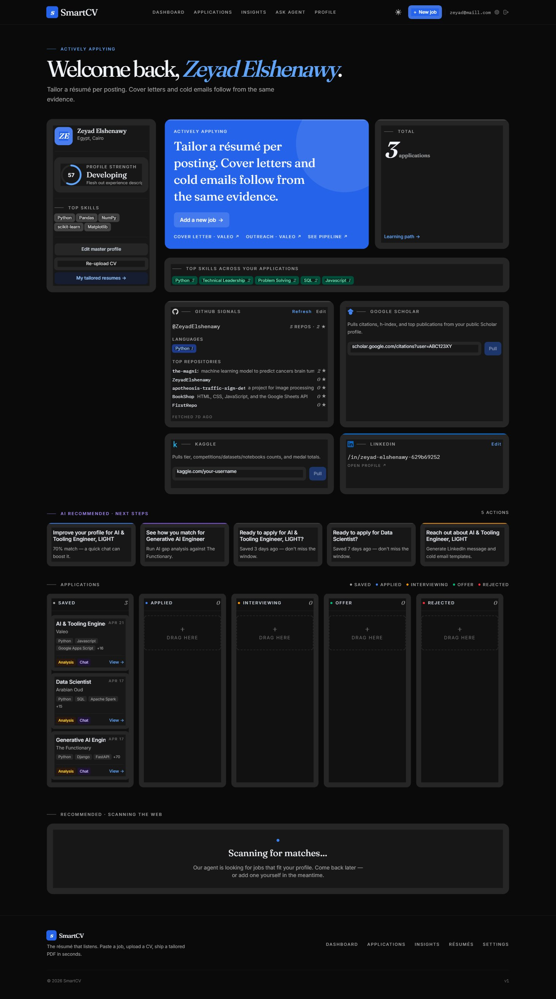
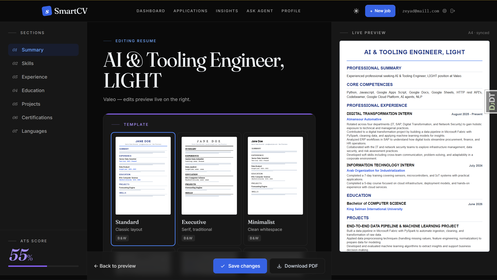
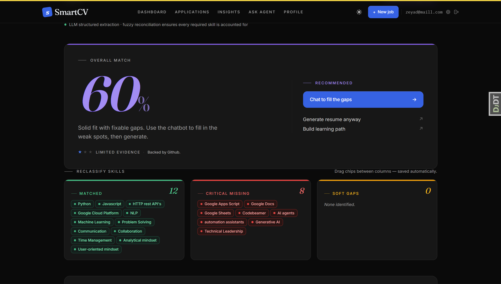
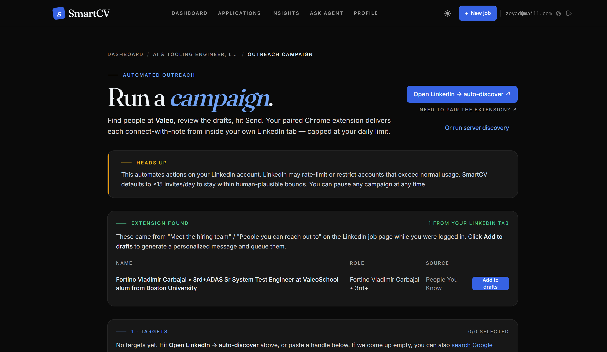

# SmartCV

[](https://www.python.org/downloads/)
[](https://www.djangoproject.com/)
[](LICENSE)
[](#benchmarks--test-results)
[](#benchmarks--test-results)

AI-powered career assistant for job seekers. Upload a CV, paste a job
description, and get a gap analysis, an ATS-scored tailored resume, and
an outreach campaign plan — backed by an LLM pipeline that reuses the
same services everywhere instead of one-off scripts.

Built with Django 5.2, PostgreSQL (Supabase + pgvector), Tailwind CSS v4,
and Groq (`meta-llama/llama-4-scout-17b-16e-instruct`).




## Highlights

- **Deterministic ATS scoring** with stuffing detection and in-context
  bonus (`resumes/services/scoring.py`).
- **Two-phase gap analysis** — LLM categorization + programmatic
  reconciliation guarantees every JD skill lands in matched / missing /
  partial (`analysis/services/gap_analyzer.py`).
- **CV parsing** with structured Pydantic output and personal-info
  extraction (`profiles/services/cv_parser.py`).
- **Outreach automation** via a Chrome extension that auto-discovers
  LinkedIn targets and drafts personalised messages
  (`extension-outreach/`).
- **Built-in observability** — per-route latency middleware,
  `/healthz/metrics` endpoint, structured request logging.

## Screenshots

### Resume editor with live preview and ATS score




Edit a tailored resume on the left, watch the print-ready preview update on
the right, and see the ATS score recompute as you type.

### Gap analysis




Two-phase pipeline: an LLM categorises every JD skill, then programmatic
fuzzy reconciliation guarantees every skill lands in `matched`, `partial`,
or `missing` — no silent drops.

### Outreach campaign builder




Per-job campaign page that pairs with a Chrome extension. The extension
discovers reachable people from inside your own LinkedIn tab and queues
personalised connect-with-note drafts for review — never automated sending.

## Benchmarks & Test Results

343 Django tests passing. Coverage 53% overall (76.9% in `core/`).

The repo ships a small, real evaluation suite under `benchmarks/` — every
metric has a sample size, a re-run command, and a JSON artifact. No
fabricated numbers. Latest run (2026-04-27):

| Metric | Value | N |
| --- | --- | --- |
| ATS scoring deterministic (σ=0) | **True** | 10 runs × 3 fixtures |
| ATS matched vs. mismatched separation | matched **100.0** / mismatched **11.0** (Cohen's d = **6.27**) | 3 vs 6 pairs |
| Endpoint warm p95 (max across routes) | **12.88 ms** | 5 routes × 100 req |
| CV parser personal-info accuracy | **0.942** | 10 CVs |
| CV parser skills F1 (CVs with explicit skills section) | **0.429** (Jaccard 0.303) | 5 of 10 CVs |
| CV parser skills F1 (all 10 CVs, incl. those without a skills section) | 0.296 (Jaccard 0.197) | 10 CVs |
| Skill extractor F1 | **0.916** (P=0.943, R=0.894, hallucination 0.057) | 5 JDs × 3 runs |
| Gap analyzer coverage | **0.997** (47/50 pairs at 100%) | 50 (CV, JD) pairs |
| Gap analyzer separation (similarity score) | strong **0.465** / partial **0.383** / weak **0.141** (Cohen's d strong-vs-weak = **1.685**) | 50 pairs |
| Tailored resume — LLM-judged (1-10) — LLM available | factuality **6.0** / relevance **6.5** / ats_fit **6.3** / human_voice **4.4** | 10 strong pairs |
| Tailored resume — programmatic entity grounding | **1.000** of generated entities appear verbatim in source CV | 10 pairs |
| Tailored resume — banned-voice hits per resume | **0.0** (offline fallback) / **0.2** (LLM available) | 10 pairs |

D5 note: the LLM-available numbers were captured earlier on 2026-04-27 before
the resume_gen Groq account hit its daily token limit (TPD: 500K). The
final consolidated artifact reflects the post-TPD fallback path (factuality
3.7, relevance 2.8, ats_fit 3.3, human_voice 1.9, grounding 1.0). The
fallback is deliberate: no fabrication, no banned phrases, JD-relevance
ordered skills — see `benchmarks/results/2026-04-26/REPORT.md` for the
full iteration history and trade-offs.

See [`docs/benchmarks.md`](docs/benchmarks.md) for full methodology, the
formulas behind each metric, fixture description, and a "what this does
not measure" disclosure. Latest JSON artifacts live in
[`benchmarks/results/`](benchmarks/results/).

Reproduce with:

```bash
python -m benchmarks.run_all                    # all phases except D5
python -m benchmarks.run_all --with-tailoring   # also runs LLM-judged tailoring
```

## Quick Start

```bash
# Setup
python -m venv .venv
source .venv/bin/activate              # or .venv\Scripts\activate on Windows
pip install -r requirements.txt
npm install                            # Tailwind CLI

# Configure (copy .env.example -> .env, fill in values)
cp .env.example .env
# then edit .env to set:
#   DATABASE_URL  (Supabase PgBouncer URL on port 6543, sslmode=require)
#   GROQ_API_KEY  (https://console.groq.com)
#   SECRET_KEY    (required for any non-test invocation; tests use a default)

# Migrate + run
python manage.py migrate
npm run build:css
python manage.py runserver
```

Tailwind v4 is built from `static/src/input.css` (CSS-first config — no
`tailwind.config.js`) into `static/css/output.css`. The built file is
committed so the dev server works without npm.

## Architecture

```
accounts/           Custom UUID User model + email auth
profiles/           CV parsing, JSONB profile, chatbot, outreach API
jobs/               Job input (URL or text) + LLM-based skill extraction
analysis/           Gap analyzer (two-phase), learning paths, salary tools
resumes/            Tailored resume gen, cover letters, PDF export (xhtml2pdf)
core/               Landing, observability middleware, metrics, healthz
extension-outreach/ Chrome extension for LinkedIn target discovery + drafting
benchmarks/         Reproducible evaluation suite (see docs/benchmarks.md)
```

LLM access is centralised in `profiles/services/llm_engine.py`:
`get_llm()` for plain text, `get_structured_llm(Schema)` for guaranteed
Pydantic-validated output. All Pydantic schemas live in
`profiles/services/schemas.py`.

## Documentation

- [`docs/benchmarks.md`](docs/benchmarks.md) — evaluation methodology + latest results
- [`docs/gap_analysis_system.md`](docs/gap_analysis_system.md) — gap-analyzer design notes
- [`docs/implementation_plan.md`](docs/implementation_plan.md) — high-level roadmap
- [`CLAUDE.md`](CLAUDE.md) — guidance for Claude Code when working in this repo

## License

[MIT](LICENSE) — see the LICENSE file for full terms.
